# Production QA Report — 2026-03-12 (v2, revised)

## Scope

| Field              | Value                                                                                                                                                                                                                           |
| ------------------ | ------------------------------------------------------------------------------------------------------------------------------------------------------------------------------------------------------------------------------- |
| URL tested         | **Local production build only** — `yarn build` + static server from `master` at `http://127.0.0.1:3000` ⚠️ _See testing note below_                                                                                             |
| Tester             | Playwright MCP agent (Copilot)                                                                                                                                                                                                  |
| Date/time          | 2026-03-12, ~23:48–00:30 UTC                                                                                                                                                                                                    |
| Viewport coverage  | Desktop 1280×720, Desktop 1280×900 (full-page), Tablet 768×1024, Mobile 375×812                                                                                                                                                 |
| Major areas tested | Home screen, New Game setup, In-game, Saves/Load/Import/Export, Team Management, Career Stats, Player Pages, How to Play, Contact, Responsive layouts, Browser back/forward, Chaotic/random user behavior, Blank-slate new-user |

> **⚠️ Testing note — local build only, not live production (approved):**
> The Playwright MCP agent could not reach the live site at `blipit.net` due to network restrictions
> in the sandbox environment. With explicit approval, this pass was conducted entirely against a local
> production build (`yarn build` served with a static file server). All findings that depend on server
> configuration are marked **⚠️ Needs production verification** and must be re-confirmed against the live
> site before acting on them — CDN behavior, server routing rules, and environment-specific settings may
> differ. Findings not marked with that label reflect application code and are expected to reproduce
> identically in production.

---

## High-level summary

BlipIt Baseball Legends is a polished and functional self-playing baseball simulator. As a brand-new user the initial experience is clear — the home screen is clean, the demo teams are auto-seeded so you can play immediately, and the game auto-runs without needing to understand anything in advance.

**What feels polished:**

- Branding and visual design are strong across all viewports
- Game flow is immediately satisfying — start a game, watch it play out, check stats
- Career stats and player pages are genuinely impressive for a solo project
- Save/Load with file export/import + clipboard paste is comprehensive
- The How to Play help content is accurate for the most part
- Error messages for bad import data are human-readable and helpful
- Contact page has pre-filled email + GitHub issue templates with auto-captured environment info

**What feels confusing:**

- The "Edit Team" page is misleadingly labeled: team name, city, abbreviation, and player names are all rendered in text inputs but are `readonly`. A new user will try to click and edit these fields and be confused. Only position and batting handedness are actually editable.
- The "Team Name" field on the Create page asks for the short nickname (e.g. "Eagles") but users unfamiliar with the "City + Name" display model may type the full name ("Lakewood Legends") resulting in an awkward combined display ("Omaha Lakewood Legends").
- On desktop at 1280×720, the full home screen requires scrolling — the Contact button is 7px below the visible fold.

**What feels broken or at risk:**

- SPA catch-all routing behavior on the production server is unconfirmed — refreshing on any non-root
  route returns a raw 404 from a plain static server. ⚠️ **Needs production verification at blipit.net.**
- A silent RxDB `CONFLICT` error fires consistently at game completion (`useRxdbGameSync: failed to
update progress (game over)`) — the final save state may not always be persisted correctly.
- The Help copy says "Edit player names" but player names cannot be edited after team creation.

**Top priority issues:** _(See Triage summary section for full P0–P3 table)_

1. **P1** — Silent RxDB CONFLICT error at game-over (save may be incomplete) — **confirmed in app code**
2. **P1\*** — SPA catch-all routing — ⚠️ **needs production verification** at blipit.net
3. **P2** — Edit Team UX: readonly fields with no explanation — **confirmed in app**
4. **P2** — Help copy discrepancy: "Edit player names" is not true — **confirmed in app**
5. **P3** — Same-team post-submit-only validation (no inline block) — **confirmed in app; game always blocked**

---

## Environment and coverage

| Viewport                                 | Tested                                                                                |
| ---------------------------------------- | ------------------------------------------------------------------------------------- |
| Desktop 1280×720                         | ✅ Full coverage — home, new game, in-game, saves, teams, career stats, help, contact |
| Desktop 1280×900 (full-page screenshots) | ✅ Layout verification                                                                |
| Tablet 768×1024                          | ✅ Home screen, visual layout                                                         |
| Mobile 375×812                           | ✅ Home, New Game setup, in-game, contact                                             |

---

## User flows tested

### Flow A: First impression / home screen discovery

**Why a new user would do this:** First page load, zero context.
**Result:** ✅ Pass

Notes:

- Logo, tagline ("Self-playing baseball simulator"), and five action buttons are immediately visible and understandable
- Demo teams (Lakewood Legends, Riverside Rockets) are seeded automatically — no setup required before clicking New Game
- Audio controls bar is visible at the bottom of the screen
- "League play coming soon" roadmap notice is clearly styled as secondary
- "Created by naftali.dev" credit link is present
- On desktop 1280×720 the full page scrolls (doc height ~1029px vs 720px viewport); Contact button bottom is at 727px — just 7px past the fold


---

### Flow B: Core navigation

**Why a new user would do this:** Explore the menu before committing to a game.
**Result:** ✅ Pass

Notes:

- All five home buttons navigate to the correct routes
- "← Back" / "← Back to Home" buttons appear consistently on all inner pages
- Browser back button works correctly from all tested routes
- Browser forward works after navigating back
- Navigating between Career Stats, Manage Teams, and back to Home works without state loss

---

### Flow C: New game setup

**Why a new user would do this:** Most obvious first action.
**Result:** ✅ Pass (with observation)

Notes:

- New Exhibition Game page shows team dropdowns, Manager Mode radio group, Seed input, and Play Ball! button
- Both demo teams are pre-selected (Lakewood Legends Away, Riverside Rockets Home)
- Manager Mode radio buttons update labels dynamically when team dropdowns change
- Seed field is pre-populated with a random value; placeholder says "random" (leave blank for random)
- Play Ball! launches the game immediately
- On desktop this page fits the 1280×720 viewport without scrolling


---

### Flow D: In-game behavior (watch mode)

**Why a new user would do this:** Default mode — just watch.
**Result:** ✅ Pass

Notes:

- Scoreboard updates pitch-by-pitch; inning columns fill in as innings complete
- B/S/O indicators update correctly
- Play-by-play ticker (▸▸▸) scrolls during live play
- Speed selector (Slow/Normal/Fast/Instant) is accessible and responsive
- Batting stats table updates live; player rows show real-time AB/H/BB/K/RBI
- Clicking a batter row opens the Player Details panel with AVG/OBP/SLG/OPS computed stats
- ✕ clear button dismisses the Player Details panel
- Hit Log and Play-by-play sections collapse/expand correctly
- After FINAL: "New Game" button appears in the controls bar; game is frozen
- "← Home" button returns to home with no stale state

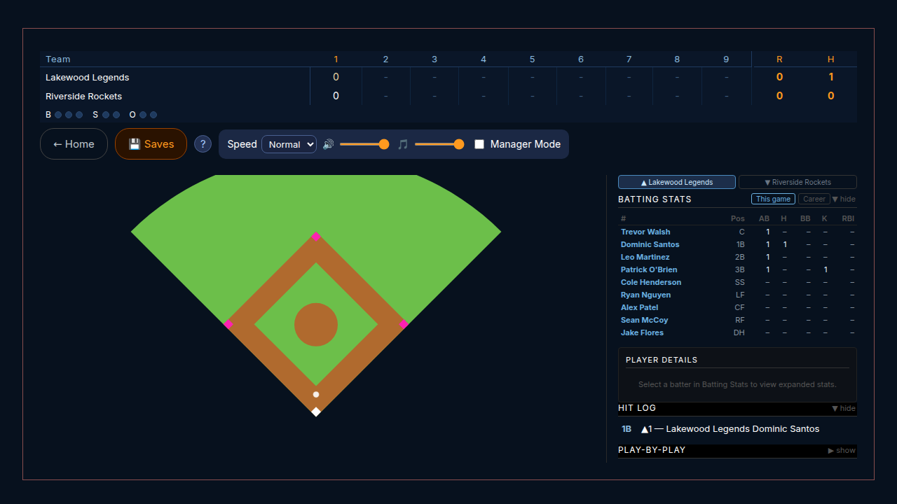
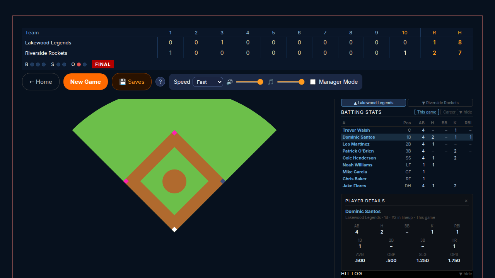

---

### Flow E: Save / Load / Import / Export

**Why a new user would do this:** Save progress, resume later, share a game.
**Result:** ✅ Pass (with observation about silent error)

Notes:

- A save is created automatically when a new game starts
- Saves panel (💾 Saves) opens as a dialog over the game, lists saves with Load/Export/Delete buttons
- Export button triggers a file download of the save JSON
- Delete shows a native `confirm()` dialog: "Delete this save? This cannot be undone."
  - Cancel: save preserved ✅
  - Confirm: save deleted ✅
- Import from text: pasting invalid JSON shows "Invalid JSON" error immediately
- Import from text: pasting valid JSON with unrecognized structure shows: _"Invalid save file: missing or unrecognized format. Please export a save from the app and try again."_ — clear, helpful ✅
- Load Saved Game from Home is a dedicated `/saves` page with file + text + clipboard import options
- Import format placeholder `{"version":1,"header":{…},"events":[…],"sig":"…"}` clearly shows expected structure
- **Observation:** Console shows `useRxdbGameSync: failed to update progress (game over)` at game completion — may mean the final save state is not persisted correctly (see ISSUE-05)

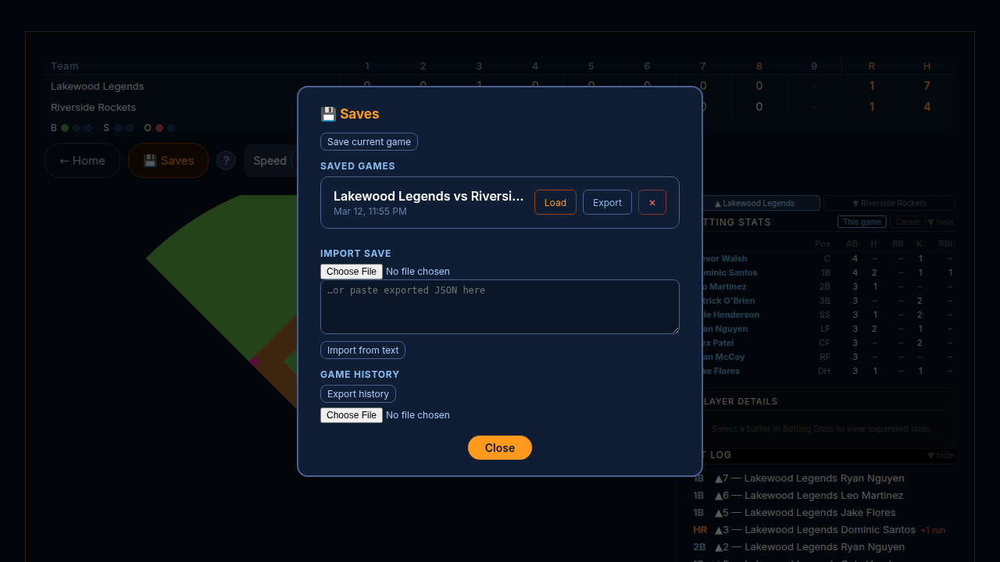
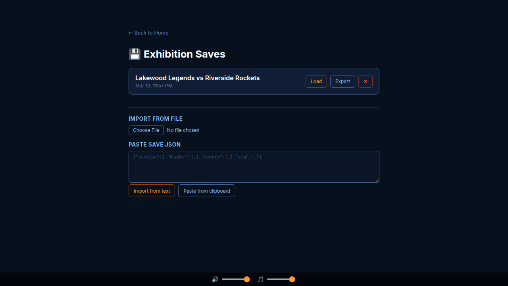

---

### Flow F: Team management

**Why a new user would do this:** Customize teams before playing.
**Result:** ⚠️ Partial (UX confusion on Edit page)

Notes:

- Manage Teams page lists both demo teams with 9 batters · 4 pitchers · 4 bench counts
- Edit button navigates to `/teams/:id/edit`
- **Confusion:** On the Edit Team page, team name, city, abbreviation, and all player name fields are rendered as text inputs but are `readonly` (aria-readonly="true"). There is no label or message explaining they cannot be changed. A new user will click on these fields expecting to type.
- On the Edit Team page, only **Position** and **Batting handedness** dropdowns are editable. Drag-to-reorder also works.
- Create New Team page: all fields are editable. ✨ Generate Random fills a complete 18-player roster with city/name/abbreviation automatically.
- Lineup validation: trying to save with no players shows "At least 1 lineup player is required." ✅
- Delete team shows confirm dialog with team name: "Delete 'Riverside Rockets'?" ✅

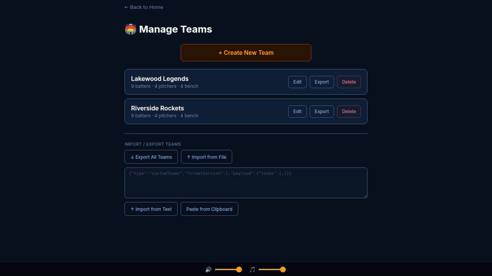
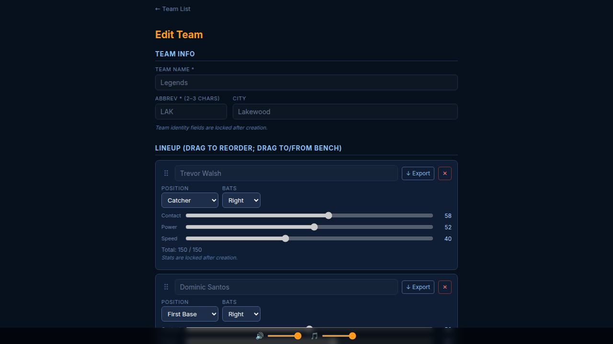
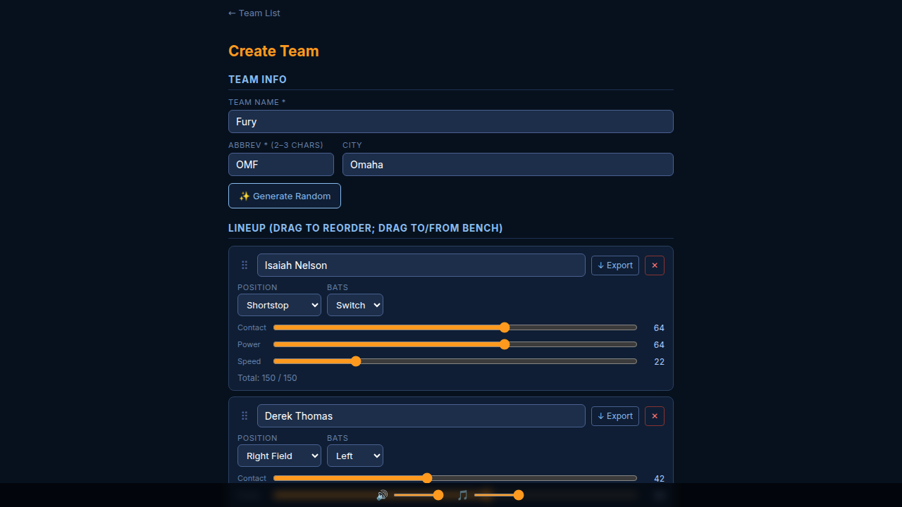

---

### Flow G: Career stats / player pages

**Why a new user would do this:** Check records after playing a game.
**Result:** ✅ Pass

Notes:

- Career Stats page shows Team Summary (GP, W-L, WIN%, RS, RA, DIFF, RS/G, RA/G, STREAK, LAST 10)
- Batting Leaders (HR, AVG, RBI) and Pitching Leaders (ERA, SV, K) with clickable leader cards
- "no qualifier" shown for AVG/ERA when plate appearance/inning minimums not met — good behavior ✅
- Batting and Pitching tab switch works; pitching table shows IP, H, BB, K, HR, R, ER, ERA, WHIP, SV, HLD, BS ✅
- Team dropdown switches between Lakewood Legends and Riverside Rockets; data updates immediately ✅
- Clicking a player name navigates to `/players/:id?team=...` career page
- Player career page shows Career Totals table + Game Log table with date and opponent
- ← Prev / Next → buttons navigate between players on the same team
- ← Back button returns to Career Stats with team selection preserved in URL ✅
- Career stats correctly recorded all players who batted (including substitutes/pinch hitters who are no longer in the active lineup)

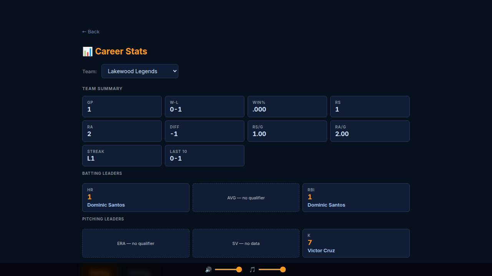

---

### Flow H: How to Play content

**Why a new user would do this:** Understand the game before or during play.
**Result:** ⚠️ Partial (one copy discrepancy found)

Notes:

- How to Play accessible from Home (dedicated `/help` page) and from the in-game controls bar (modal overlay)
- Both use the same accordion-style content with 9 sections: Basics, Pre-game customization, Custom Teams, Game Flow, Manager Mode, Live batting stats, Saves, Hit types, Reporting issues
- Basics section is expanded by default; all other sections collapse/expand on click
- Content is generally accurate and clear
- **Discrepancy found:** Custom Teams section states: _"Edit player names and positions to customize it."_ — however, player names are `readonly` in the Edit Team page and cannot be changed after creation. Only positions (and batting handedness) are editable. The copy should read something like "Edit player positions and batting handedness to customize it."

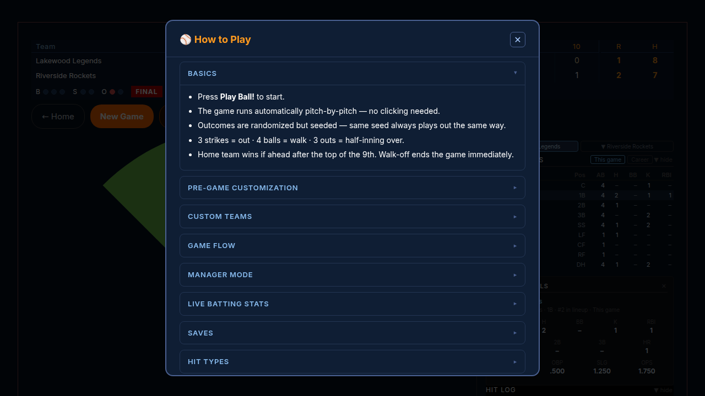
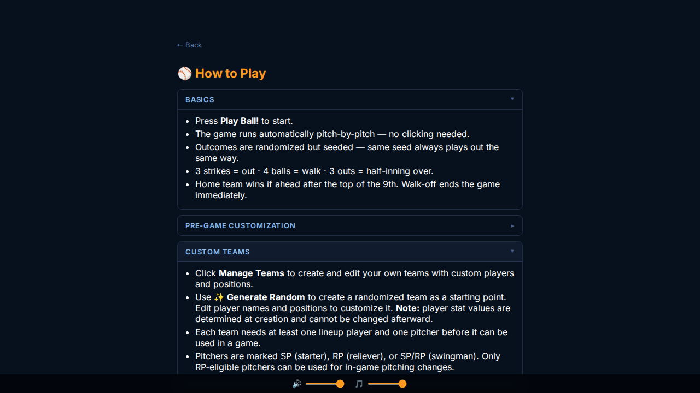

---

### Flow I: Responsive / viewport QA

#### Desktop 1280×720

- Home screen: all main buttons visible; Contact / Report Bug is just 7px below the fold (see ISSUE-04)
- New game setup: fits the viewport without scrolling ✅
- Game page: all controls visible; no horizontal overflow ✅

#### Tablet 768×1024

- Home screen: clean layout, all buttons visible, comfortable spacing ✅
- Content fits comfortably within the viewport

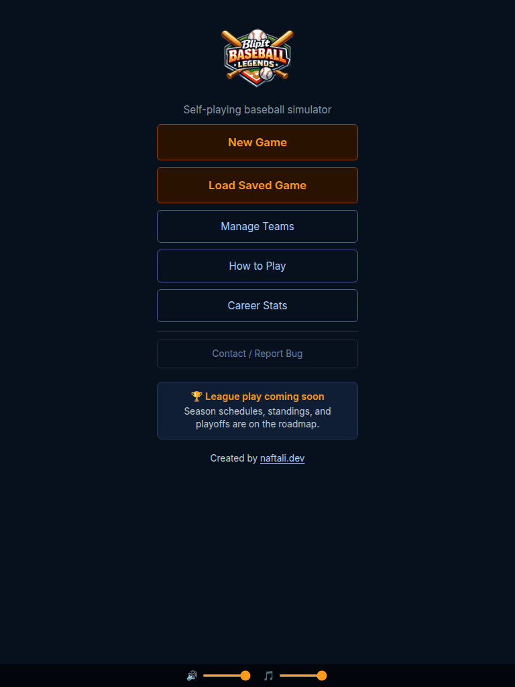

#### Mobile 375×812

- Home screen: all 6 navigation buttons visible; Contact button at y:549 — no scrolling needed ✅
- New game setup: form fits without scrolling ✅
- Game page: scoreboard uses abbreviations (LAK/RIV); no horizontal overflow (docWidth = 375) ✅
- Batting stats table width 343px, right edge at 359px — within 375px viewport ✅
- Contact page: content fits without scrolling ✅

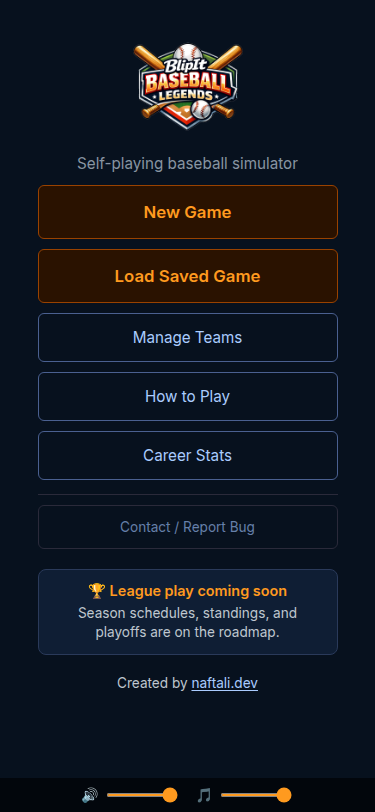
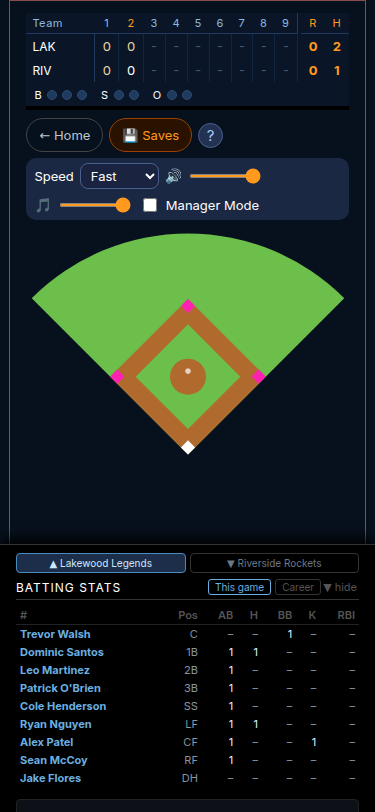
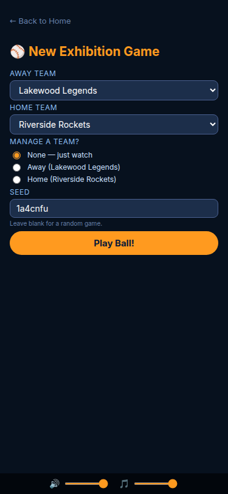
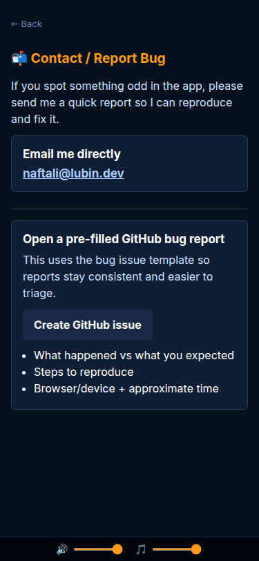

---

### Flow J: Random / chaotic behavior

**Result:** Mixed — most chaos handled gracefully; a few gaps found.

| Chaotic action                                                                           | Result                                                               |
| ---------------------------------------------------------------------------------------- | -------------------------------------------------------------------- |
| Open saves panel → type garbage JSON → import                                            | Clear "Invalid JSON" error ✅                                        |
| Paste structurally-valid but wrong-format JSON                                           | Clear human-readable error ✅                                        |
| Open saves panel → close → reopen repeatedly                                             | No state leaks, modal re-renders cleanly ✅                          |
| Delete save → cancel → verify save still present                                         | Save preserved ✅                                                    |
| Click same player row multiple times                                                     | Player details toggle (second click does not crash) ✅               |
| Collapse batting stats → collapse hit log → expand both                                  | Both toggles work independently ✅                                   |
| Navigate Home → New Game → Back → New Game quickly                                       | No stale state ✅                                                    |
| Start game → save → go Home → Load Saved Game                                            | Loads correctly ✅                                                   |
| Navigate to /game directly by typing URL                                                 | 404 error (see ISSUE-06) ⚠️                                          |
| Navigate to /stats, /teams, /help via app then browser-back to root then browser-forward | Works correctly ✅                                                   |
| Set both Away and Home to same team                                                      | Validation error on submit; game blocked (see ISSUE-07)              |
| Create team → Generate Random → change Team Name to something long / overlapping         | Saved with no error; display name = "City + Name" combined correctly |
| Create team with no players → Save                                                       | Shows "At least 1 lineup player is required." validation ✅          |

---

## Issues found

### ISSUE-01: Edit Team page — all identity fields are readonly with no explanation

- **Severity:** Medium
- **Type:** UX
- **Viewport(s):** All
- **Preconditions:** At least one custom team exists
- **Steps to reproduce:**
  1. Go to Manage Teams
  2. Click Edit on any team
  3. Try to click the Team Name, City, Abbreviation, or any Player Name field
- **Expected result:** Either the fields are editable, or a clear message explains they are locked after creation
- **Actual result:** All fields appear as styled text inputs but have `readonly`/`aria-readonly="true"` attributes. Clicking does nothing. No tooltip, no disabled styling, no explanation.
- **Frequency:** Always
- **Screenshot:**

  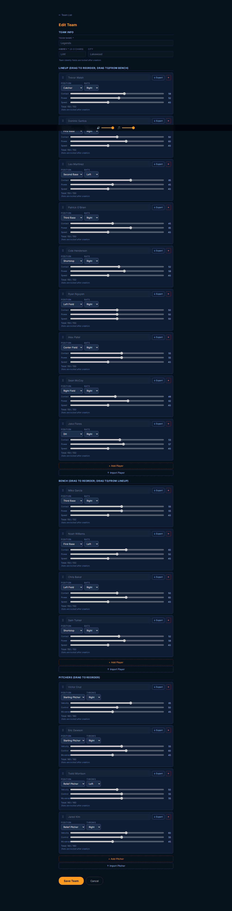
  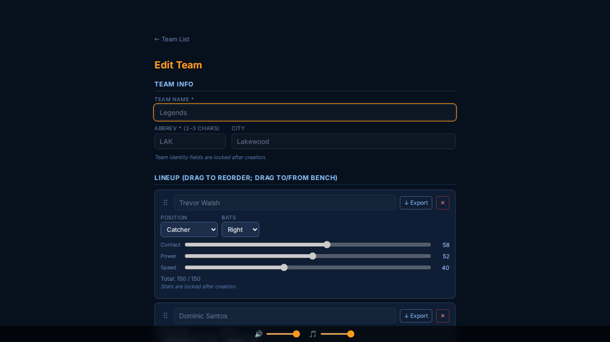

- **Notes:** Only Position (combobox) and Batting Handedness (combobox) are editable. The drag handle for lineup reordering also works. Everything else is silently locked. A new user will be confused by this with no guidance. The page heading "Edit Team" compounds the expectation mismatch.

---

### ISSUE-02: Help copy says "Edit player names" but player names are readonly

- **Severity:** Medium
- **Type:** Copy / Documentation
- **Viewport(s):** All
- **Preconditions:** None
- **Steps to reproduce:**
  1. Open How to Play (from Home or in-game)
  2. Expand "Custom Teams" section
  3. Read: _"Edit player names and positions to customize it."_
  4. Go to Manage Teams → Edit any team
  5. Try to edit any player name
- **Expected result:** Copy accurately describes what can be edited
- **Actual result:** Copy says "player names" can be edited but they cannot. Only positions and batting handedness are editable.
- **Frequency:** Always
- **Screenshot:**

  

- **Notes:** Suggested correction: _"Edit player positions and batting handedness to customize it."_ or _"Drag players to reorder the lineup. Player stat values and names are fixed at creation."_

---

### ISSUE-03: "Team Name" field label doesn't clarify it's the nickname only (not full display name)

- **Severity:** Low
- **Type:** UX / Copy
- **Viewport(s):** All
- **Preconditions:** Creating a new team
- **Steps to reproduce:**
  1. Go to Manage Teams → Create New Team
  2. Notice "Team Name \*" field with placeholder "e.g. Eagles"
  3. Type a full team name like "Lakewood Legends" in Team Name, keep City as "Omaha"
  4. Save the team
- **Expected result:** User understands that display name = City + Team Name
- **Actual result:** Team is saved as "Omaha Lakewood Legends" — a confusing double-name. No label hints that Team Name is the short nickname.
- **Frequency:** Whenever a user types a full team name into the Team Name field
- **Screenshot:**

  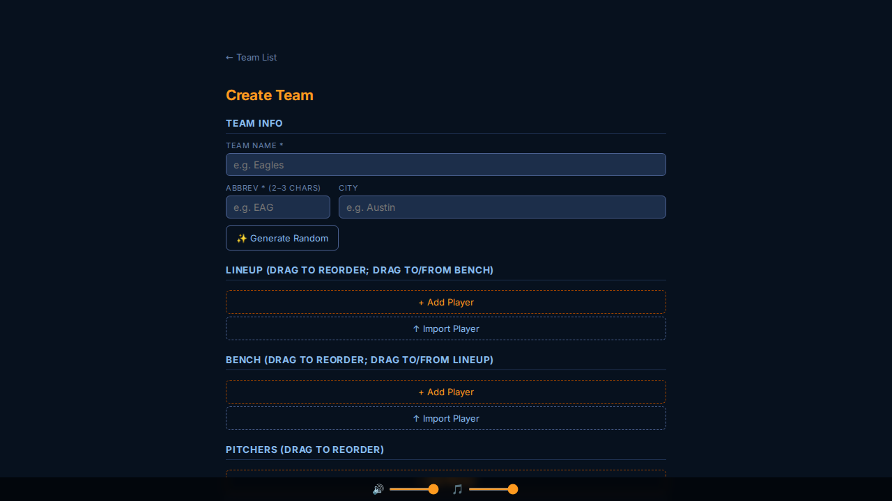
  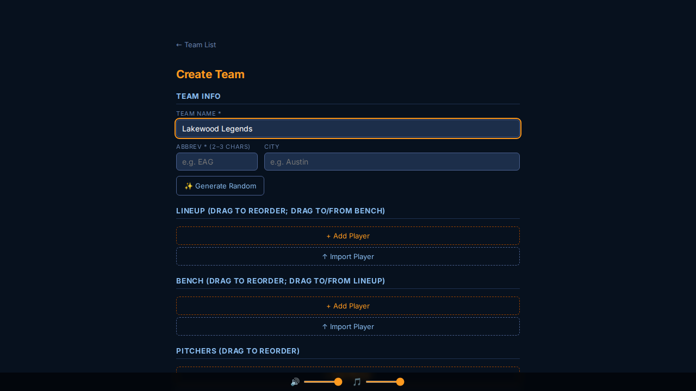

- **Notes:** Could be fixed with a label change ("Team Nickname \*") or a hint text ("This is combined with City to form the full name, e.g. 'City Eagles'").

---

### ISSUE-04: Desktop 1280×720 — home page requires scrolling; Contact button just past fold

- **Severity:** Low
- **Type:** Responsiveness
- **Viewport(s):** Desktop 1280×720
- **Preconditions:** None
- **Steps to reproduce:**
  1. Open the app at 1280×720 viewport
  2. Observe the home screen without scrolling
- **Expected result:** Full home screen visible without scrolling
- **Actual result:** Document scroll height is 1029px. Contact / Report Bug button bottom edge is at y=727px (7px below the 720px viewport). The full page requires ~309px of scrolling to see footer content.
- **Frequency:** Always at this viewport
- **Screenshot:** 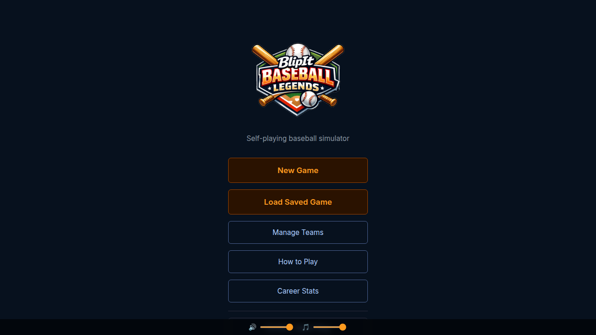
- **Notes:** At 375px mobile the page fits with room to spare. The issue is specific to the 720px height where the content stack plus the audio controls bar just exceeds the viewport.

---

### ISSUE-05: Silent RxDB CONFLICT error at game completion — final save may be incomplete

- **Severity:** Medium
- **Type:** Bug / Data integrity
- **Viewport(s):** All
- **Confirmed:** ✅ App code — reproduced consistently in this QA pass
- **Steps to reproduce:**
  1. Start a new game
  2. Let the game run to FINAL (Instant speed triggers it reliably)
  3. Open browser DevTools → Console
- **Expected result:** Game-over state persisted cleanly to the save record
- **Actual result:** Console shows:
  ```
  useRxdbGameSync: failed to update progress (game over) saveId=save_...
  RxDB Error-Code: CONFLICT (HTTP 409) — collection: "saves"
  ```
  This is a write conflict: a periodic progress-sync write races against the game-over finalization
  write for the same document. The finalization write loses. The final `progressIdx` may not be
  persisted.
- **Frequency:** Consistently observed when using Instant speed; may be intermittent at lower speeds
- **Screenshot:**

  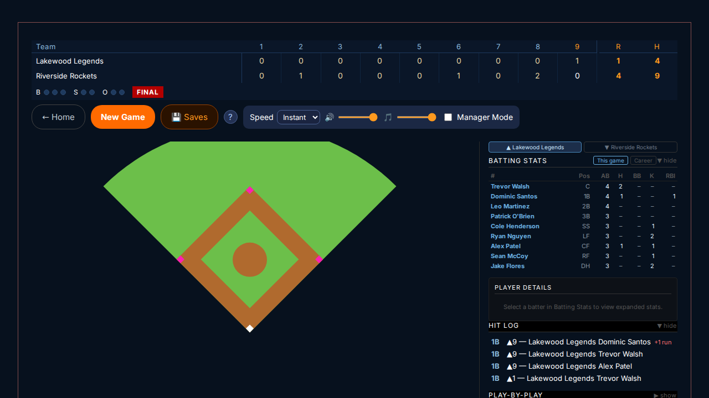

- **Notes:** The error is entirely silent — no user-facing message or banner. If the final game state is
  not written to RxDB, loading this save later might show an incomplete game. The save entry does appear
  in the saves list but its content accuracy is uncertain.

---

### ISSUE-06: SPA routing — refreshing or directly navigating to non-root routes returns 404

- **Severity:** High (deployment configuration)
- **Type:** Bug / Infrastructure
- **Viewport(s):** All
- **Confirmed:** ⚠️ **Local plain static server only — needs production verification at blipit.net**
- **Steps to reproduce (local):**
  1. Navigate to any non-root route via the app (e.g. `/stats`, `/teams`, `/saves`, `/help`)
  2. Refresh the page (F5 / Cmd+R) or paste the URL directly into the address bar
- **Expected result:** App loads and the correct route renders (server serves `index.html` for all paths)
- **Actual result (local plain static server):** Server returns HTTP 404 "File not found" — raw error
  page, React app never loads
- **Frequency (local):** Always on a plain static file server with no catch-all rule
- **Screenshot:**

  
  

- **Notes:** This was observed against a minimal local static server with no SPA catch-all rule. The
  production server at blipit.net may already be configured correctly (e.g. Nginx `try_files $uri
/index.html`, Netlify `_redirects`, Vercel `rewrites`). **Please verify on production by refreshing on
  `/stats`, `/teams`, `/saves`, `/help`, and `/game` directly.** If the issue exists in production, any
  user who bookmarks a page, refreshes mid-game, or shares a link will hit a hard error with no recovery
  path.

---

### ISSUE-07: New Game setup — same-team validation is post-submit only; no inline warning

- **Severity:** Low
- **Type:** UX
- **Viewport(s):** All
- **Confirmed:** ✅ App code — reproduced consistently for all team types
- **Steps to reproduce:**
  1. Go to New Game
  2. Set both Away and Home dropdowns to the same team
  3. Observe the form before clicking Play Ball
  4. Click Play Ball
- **Expected result:** Ideally an inline validation hint appears while both dropdowns show the same
  value, before the user even clicks Play Ball
- **Actual result:** No validation indicator appears while the same team is selected on both sides.
  The Manager Mode radio buttons silently show two identical labels
  (e.g. "Away (Lakewood Legends)" and "Home (Lakewood Legends)"). Only _after_ clicking Play Ball does
  the error appear: _"⚠ Away and home teams must be different — choose two different teams."_ The
  game does not start.
- **Frequency:** Always, for all team types
- **Screenshot:**

  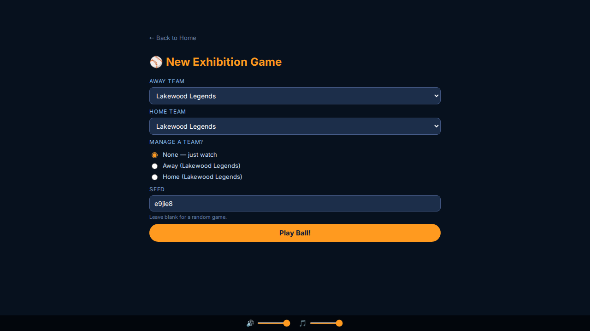
  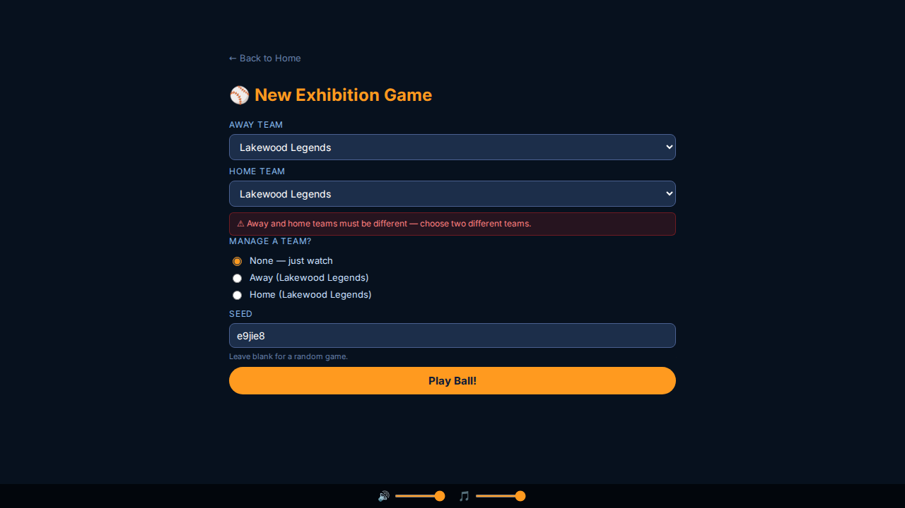

- **Notes:** The validation logic is correct and the error message is clear. The gap is only in
  proactiveness — disabling Play Ball or showing an inline hint while the dropdowns match would prevent
  the user from having to submit to learn about the conflict. The error does clear immediately when
  the user selects different teams.

---

## Same-team matchup investigation

> This section is a targeted follow-up to resolve the same-team question noted in the initial QA pass.

**Question being investigated:** Is the same-team matchup observation (from the blank-slate session) a
general validation bug, a demo-team-only quirk, or something else?

### Methodology

Four cases were tested in isolated browser sessions using a local production build:

1. Lakewood Legends vs Lakewood Legends (demo team)
2. Riverside Rockets vs Riverside Rockets (demo team)
3. A newly created custom team vs itself (with demo teams also present in the database)
4. Behavior after going Back and re-entering New Game after a same-team selection

For each case, the following was recorded:

- Whether the UI allows the selection without any inline warning
- Whether a validation error appears (and when — before or after submit)
- Whether Play Ball! is blocked or enabled at the time of selection
- Whether the game actually navigates to `/game` on submit

### Findings

| Case                              | Inline warning | Play Ball blocked | Error on submit                                                          | Game starts |
| --------------------------------- | -------------- | ----------------- | ------------------------------------------------------------------------ | ----------- |
| Lakewood Legends vs Lakewood      | ❌ None        | ❌ Not blocked    | ✅ "Away and home teams must be different — choose two different teams." | ❌ Blocked  |
| Riverside Rockets vs Riverside    | ❌ None        | ❌ Not blocked    | ✅ Same error                                                            | ❌ Blocked  |
| Custom team (Columbus) vs itself  | ❌ None        | ❌ Not blocked    | ✅ Same error                                                            | ❌ Blocked  |
| After Back + re-entering New Game | ❌ None        | ❌ Not blocked    | ✅ Same error (if re-submitted)                                          | ❌ Blocked  |

Additional finding — error recovery: When the user fixes the selection (picks different teams after seeing
the error), the error message disappears immediately from the form without requiring another submit.
Play Ball then navigates to `/game` successfully.


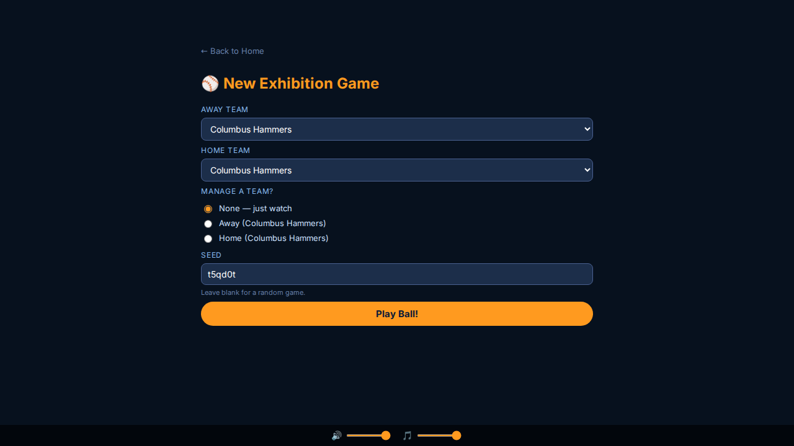

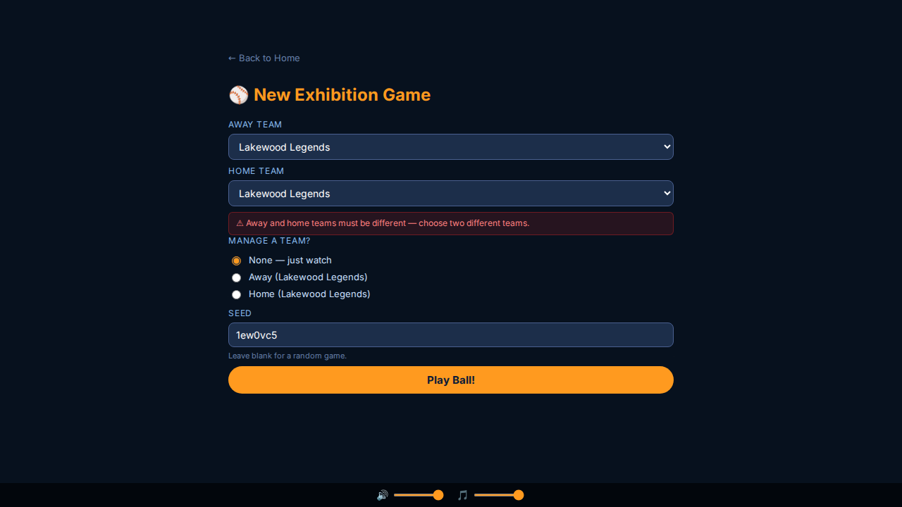
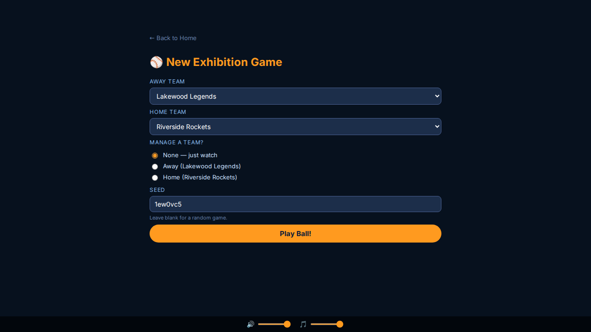

### Conclusion

The same-team matchup question is **resolved**:

- This is **not** a demo-team-only issue — it applies to all team types equally
- This is **not** a validation bug that lets a game start with the same team on both sides — the game
  is always blocked
- This **is** a minor UX gap: the Play Ball button is not disabled and no inline hint appears while
  the same team is selected; the user must click Play Ball to discover the conflict
- Confidence: ✅ **App-confirmed** — consistent across all four cases, all team types

---

| Action                                                 | Observed behavior                                                             | Assessment                                 |
| ------------------------------------------------------ | ----------------------------------------------------------------------------- | ------------------------------------------ |
| Open saves panel during FINAL game                     | Panel opens cleanly; Save button still available                              | ✅                                         |
| Click Play-by-play expand → collapse → expand          | Works cleanly each time                                                       | ✅                                         |
| Collapse Hit Log entirely                              | "No hits yet" / empty state displays correctly before any hits                | ✅                                         |
| Quickly switch Away/Home team dropdowns back and forth | Manager Mode labels update synchronously                                      | ✅                                         |
| Erase Seed field and leave blank                       | Game should use random seed                                                   | ✅ (per help text, blank = random)         |
| Type garbage in Seed field                             | Game accepts any string as seed                                               | Observation — no validation on seed format |
| Create team → Generate Random → immediately Save       | Saves successfully with full 18-player roster                                 | ✅                                         |
| Delete team → Cancel                                   | Team preserved; active button focus remains on delete button                  | ✅                                         |
| Export a save from saves panel                         | Browser download triggered (file content not verified)                        | ✅                                         |
| Click "Paste from Clipboard" in saves page             | Button present and rendered (clipboard prompt depends on browser permissions) | ✅                                         |
| Navigate directly to `/help` via typed URL             | 404 from static server (same as ISSUE-06)                                     | ⚠️                                         |
| Set both teams to same team                            | Validation error on submit; game blocked (see ISSUE-07)                       | ⚠️ Post-submit only; no inline warning     |

---

## Passed checks

- ✅ Home screen loads with correct demo teams auto-seeded
- ✅ New Game setup: team dropdowns, Manager Mode radio, Seed field, Play Ball! button
- ✅ Manager Mode radio labels update dynamically when teams change
- ✅ Game auto-plays through full 9 innings (and extra innings if tied)
- ✅ Scoreboard fills in inning by inning with correct R/H columns
- ✅ B/S/O indicators update correctly pitch by pitch
- ✅ FINAL banner appears when game ends
- ✅ "New Game" button appears in controls bar after FINAL
- ✅ "← Home" returns to home with no stale state after FINAL
- ✅ No resume button shown on home screen after a FINAL game (correct behavior)
- ✅ Auto-save created at game start
- ✅ Saves panel opens/closes cleanly
- ✅ Delete save with cancel → save preserved
- ✅ Delete save with confirm → save removed
- ✅ Import invalid JSON → clear error "Invalid JSON"
- ✅ Import wrong-structure JSON → clear human-readable error message
- ✅ Save export triggers file download
- ✅ How to Play opens from Home (standalone page) and in-game (modal)
- ✅ All 9 How to Play accordion sections expand/collapse correctly
- ✅ Help content is accurate for Basics, Game Flow, Manager Mode sections
- ✅ Batting stats table live-updates during game
- ✅ Clicking player row shows Player Details panel (AVG/OBP/SLG/OPS computed)
- ✅ ✕ button clears player detail selection
- ✅ Hit Log shows hit type + inning + player name
- ✅ Career Stats loads with correct Team Summary after game
- ✅ Batting/Pitching tab switch in Career Stats works
- ✅ Team dropdown in Career Stats switches data correctly
- ✅ "no qualifier" / "no data" shown for leaders when thresholds not met
- ✅ Player career page shows Career Totals + Game Log
- ✅ ← Prev / Next → buttons navigate between players
- ✅ ← Back from player page returns to Career Stats with team URL param preserved
- ✅ Manage Teams shows team roster counts (N batters · N pitchers · N bench)
- ✅ Create Team form has editable name/city/abbreviation/players
- ✅ ✨ Generate Random populates a complete team
- ✅ Save with no players shows "At least 1 lineup player is required."
- ✅ Delete team confirm dialog includes team name
- ✅ Contact page email link pre-fills bug report template with auto-captured environment info
- ✅ Contact page GitHub issue link uses bug template
- ✅ Mobile 375×812: home screen fits viewport, no scrolling, no horizontal overflow
- ✅ Mobile 375×812: game scoreboard uses abbreviations (LAK/RIV)
- ✅ Mobile 375×812: tables fit within 375px viewport, no horizontal overflow
- ✅ Tablet 768×1024: home screen layout is clean and comfortable
- ✅ Browser back/forward works correctly across all tested routes
- ✅ Audio volume sliders functional and accessible on home screen and in-game

---

## Open questions / uncertain items

1. **Production SPA routing** ⚠️ _Needs production verification_ — Is blipit.net configured with a
   proper SPA catch-all (`try_files` / `_redirects`)? This is critical for any user who refreshes on a
   non-root route. Could not confirm from local build alone.

2. **RxDB save-at-FINAL integrity** — The `useRxdbGameSync: failed to update progress (game over)` RxDB
   CONFLICT error was observed consistently (every Instant-speed game in this pass). The conflict is a
   write race between the periodic progress-sync and the game-over finalization. Does this also occur at
   Slow/Normal speed? What exactly is lost?

3. **Seed validation** — Seed field accepts any arbitrary string. Is there any normalization, max-length
   clamping, or character restrictions applied on submit? Could a very long seed string cause any issues?

4. **Extra innings behavior** — In one game, a `10` column appeared in the scoreboard for extra innings.
   Is there a hard maximum on extra innings? What happens if a game never ends (both teams perfectly
   tied)?

5. **Career stats with 0 games** — Career Stats was tested with no prior game history; the page rendered
   cleanly with empty tables. ✅ Confirmed working.

6. **Same-team matchup** ✅ _Resolved — see Same-team investigation section._ The same-team validation
   exists and is consistent across all team types (demo and custom). The game is always blocked. The
   only gap is that the Play Ball button is not disabled proactively and no inline hint appears before
   submit.

---

## Supplemental QA pass — blank-slate new-user perspective

> This section documents a second QA pass with an explicit "knows nothing" mindset: a user who has never
> seen the app, clicks things organically, misunderstands labels, and tries unexpected sequences. This is
> qualitative and narrative, not a structured test plan.

### First contact — what I clicked first and why

On first load the home screen presents six clearly labeled buttons. My first instinct as a new user was
**not** to click New Game — I clicked **How to Play** instead, because I wanted to understand the app
before committing to anything.

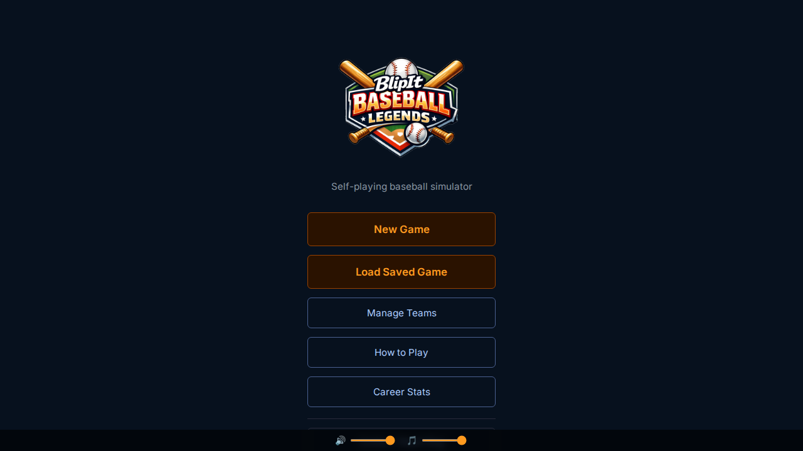
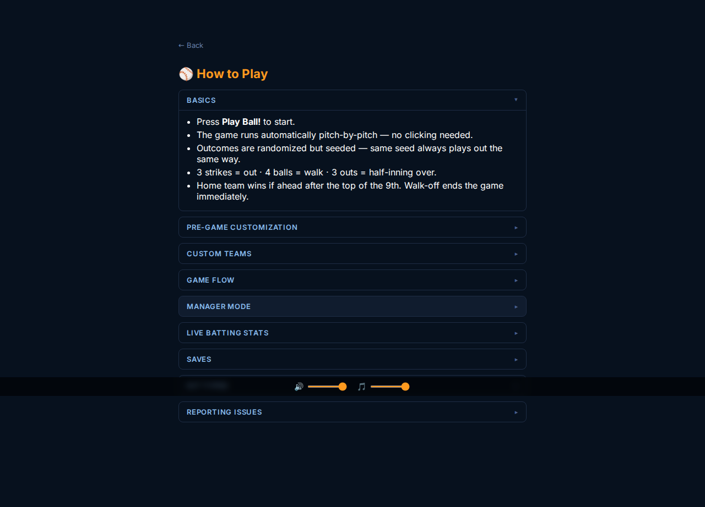

**What confused me initially:** The How to Play page opens with Basics already expanded — clear enough.
But the remaining eight accordion sections are all collapsed by default. The collapsed headers
("Pre-game customization", "Custom Teams", "Game Flow"…) give very little signal about _what_ each
section explains. A scanning user might not realize there's a dedicated section for Saves or Manager
Mode without opening every one.

**What I misunderstood before I figured it out:** I expanded "Custom Teams" and read _"Edit player names
and positions to customize it."_ I assumed I could click into a team and rename players. I went to
Manage Teams → Edit, clicked on player name fields, and nothing happened. It took me several clicks
across multiple fields before I realized they were all `readonly`. The copy is incorrect and the UX
gives no hint.


---

### Poking around in Manage Teams before playing

**What I did:** Went to Manage Teams before starting any game, curious about how customization worked.

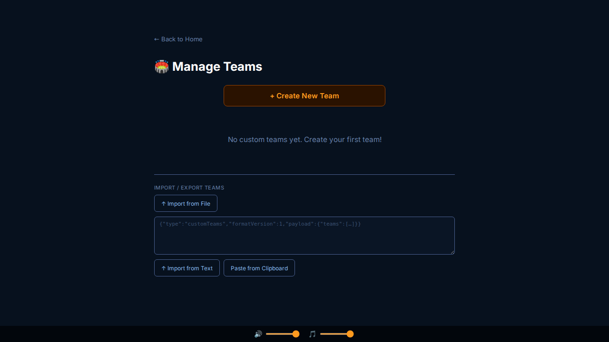

**What felt unintuitive:** Clicking Edit on Lakewood Legends opened a page showing Team Name, City,
Abbreviation, and every player's name in styled text inputs. I clicked "Team Name". Nothing. I clicked a
player's name. Nothing. I tried clicking City. Still nothing. There is zero visual distinction between
these locked inputs and the functional Position / Batting dropdowns. The heading "Edit Team" compounds
the problem — it primes the user to expect full editing.


**What I tried that a real user would try:** After getting confused on the Edit page I went back and
tried Create New Team instead, to see whether naming worked there. It does — on the Create page all
fields are editable. This made me realize the Edit page intentionally locks the identity fields, but
there's no indication of that in the UI.

---

### Trying strange things on New Game setup

**Same team vs same team:** I set both dropdowns to Lakewood Legends just to see what would happen.
The app allowed me to make that selection with no inline warning — the Manager Mode radio buttons showed
"Away (Lakewood Legends)" and "Home (Lakewood Legends)" as identical labels with no hint that this was
invalid. I clicked Play Ball and _then_ the error appeared: "⚠ Away and home teams must be different
— choose two different teams." The game did not start. A follow-up investigation (see Same-team
matchup investigation section) confirmed this behavior is consistent across all team types and is
not a validation gap that lets a game start — it is a proactiveness gap where the error appears
after submit rather than inline.


---

### Checking Career Stats before playing

I clicked Career Stats before starting any game, expecting either an empty state or an error. The page
loaded cleanly and showed an empty Team Summary table — correct empty-state behavior, no errors.

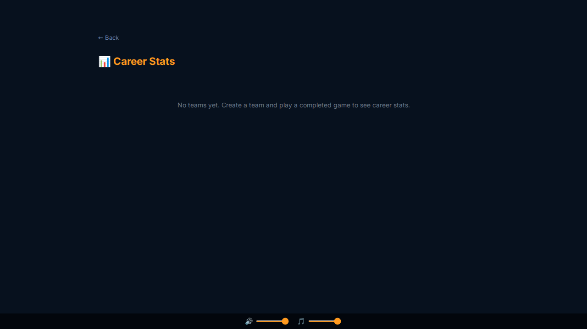

---

### Create team — Team Name label confusion

On the Create New Team form, "Team Name \*" with placeholder _"e.g. Eagles"_ did not communicate to me
that this was a _nickname only_. I typed "Lakewood Legends" into the field. If I then saved with City as
"Omaha", the team would display as "Omaha Lakewood Legends". The City + Name display model is not
explained anywhere on the form.


---

### Mobile blank-slate experience

The mobile first load is clean and confident — all six action buttons are visible without scrolling at
375×812. Nothing is hidden, nothing overflows. Demo teams load automatically. A mobile-only user would
have no trouble starting a game.

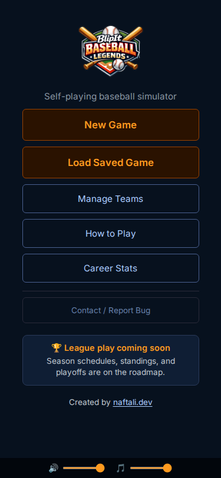

---

### Refreshing on a non-root route

After navigating to `/stats` via the app, I pressed refresh. The plain static server returned a raw 404. The React app never loaded. There was no "go back" button — just a hard dead end. This is a
critical risk if the production server is not configured with an SPA catch-all. Any user who bookmarks
their stats page, shares a link, or refreshes mid-game hits this. ⚠️ _Needs production verification._


---

## Issue triage summary

> Prioritization layer added to make the report actionable without additional sorting. Each issue is rated
> P0 (blocker) → P3 (polish), and labeled by confidence and scope.

| Issue    | Title                                                  | Priority | User impact                                                                                                   | Confidence                                                        | Scope                                   |
| -------- | ------------------------------------------------------ | -------- | ------------------------------------------------------------------------------------------------------------- | ----------------------------------------------------------------- | --------------------------------------- |
| ISSUE-05 | Silent RxDB CONFLICT at game-over                      | **P1**   | High — final game state may not be saved; user has no indication; loaded save may be incomplete               | ✅ App-confirmed — consistent reproduction                        | All users, all game endings             |
| ISSUE-06 | SPA routing — 404 on direct/refresh navigation         | **P1\*** | Critical if unmitigated — any bookmark, share, or mid-game refresh returns hard error with no recovery path   | ⚠️ Local plain static server only — needs production verification | All users navigating non-root routes    |
| ISSUE-01 | Edit Team page — identity fields are silently readonly | **P2**   | Medium — users who attempt to customize teams will be confused and may abandon customization                  | ✅ App-confirmed                                                  | Users who edit teams                    |
| ISSUE-02 | Help copy says "Edit player names" — incorrect         | **P2**   | Medium — misleads users who read help before editing; compounds ISSUE-01 confusion                            | ✅ App-confirmed                                                  | Users who read How to Play              |
| ISSUE-03 | "Team Name" label doesn't clarify it's a nickname only | **P3**   | Low — leads to awkward compound names (e.g. "Omaha Lakewood Legends") if user types full name                 | ✅ App-confirmed                                                  | Users creating custom teams             |
| ISSUE-04 | Desktop 1280×720 — Contact button 7px past fold        | **P3**   | Low — Contact is barely below fold on one common viewport; easily discovered by scrolling                     | ✅ App-confirmed                                                  | Desktop 720p viewport only              |
| ISSUE-07 | New Game — same-team validation is post-submit only    | **P3**   | Low — validation exists and blocks the game correctly; gap is only that Play Ball is not proactively disabled | ✅ App-confirmed                                                  | Users who accidentally select same team |

> **Priority key:**
>
> - **P0** — Blocker (app broken for all users; nothing in this report reached P0)
> - **P1** — High (significant functionality impaired; should be fixed before broad promotion)
> - **P2** — Medium (clear UX problem; causes confusion or abandonment; fix in next release cycle)
> - **P3** — Low / Polish (minor friction; visible but not blocking)
>
> **\* ISSUE-06** is rated P1 only if the production server lacks a SPA catch-all rule. If blipit.net
> already handles this (e.g. via Netlify/Vercel rewrites), the effective priority drops to **N/A**.
> This must be verified before filing a ticket.

---

## Final assessment

**Is production in good shape for a first-time user?**
Mostly yes. The core game loop is complete, polished, and satisfying. A new user can open the app, start a game immediately with the demo teams, watch it play out, check stats, and save their game — all without hitting any blocking errors or confusing dead ends.

**Biggest risks:**

1. **SPA routing** — If the production server is not configured with a catch-all, refreshing mid-game is a critical failure for any user
2. **Silent RxDB save error at game-over** — Could lead to incomplete save data without user awareness
3. **Edit Team UX** — Users who go to customize teams will be frustrated by readonly-but-styled-as-editable fields; likely to abandon team customization
4. **Help copy discrepancy** — "Edit player names" is incorrect; medium-impact for users who read the docs

**Suggested next fixes in priority order:** _(see Triage summary for full details)_

1. **P1** — Investigate and fix `useRxdbGameSync` game-over CONFLICT; add user-visible save
   confirmation banner
2. **P1\*** — Verify SPA catch-all routing on production server (blipit.net); if missing, add
   `_redirects` / `try_files` / rewrites rule
3. **P2** — Edit Team page: make locked fields visually distinct (`disabled` + greyed styling or a
   clear "locked after creation" notice); rename page or add subtitle
4. **P2** — Help copy fix: "Edit player names and positions" → "Edit player positions and batting
   handedness" (or similar accurate description)
5. **P3** — "Team Name" field: add "(nickname only)" hint or rename label to "Team Nickname"
6. **P3** — Desktop 720p home screen: reduce padding so the Contact button fits above the fold
7. **P3** — New Game form: disable Play Ball proactively when same team is selected on both sides
