# ⚾ Ballgame

A self-playing, talking baseball simulator that runs entirely in your browser. Watch a full 9-inning game unfold pitch by pitch — or jump in as the Manager and call the shots yourself.

**[▶ Play it live](https://blipit.net/)**

> **Install as an app** — open [blipit.net](https://blipit.net/) on Android or desktop Chrome, tap the browser menu, and choose **"Add to Home Screen"** (or "Install app") to get a native-feeling PWA with its own ⚾ icon.

---

## Screenshots

### Home screen

| Desktop | Mobile |
|---|---|
| 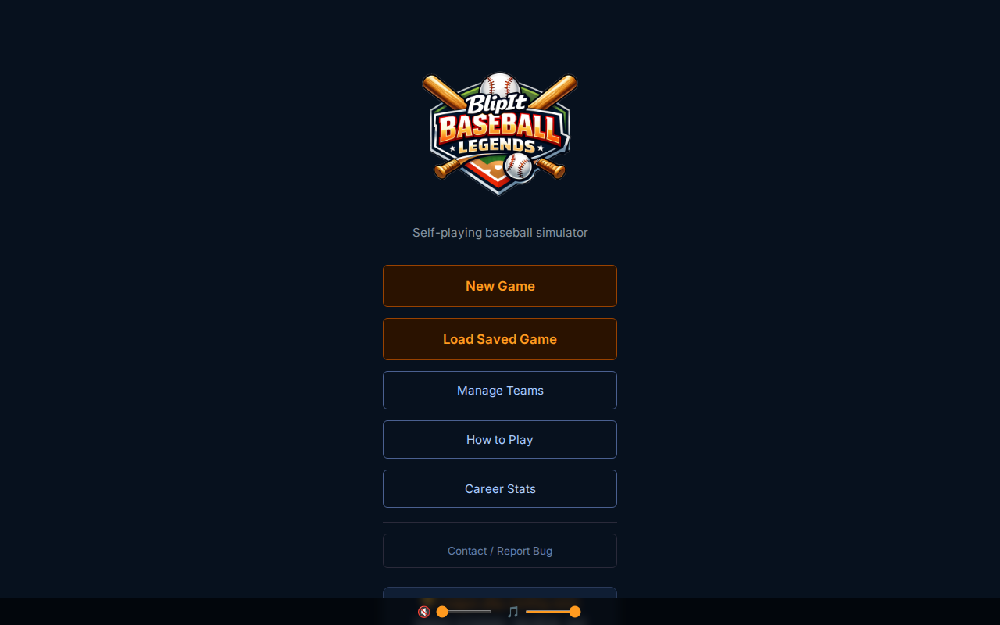 | 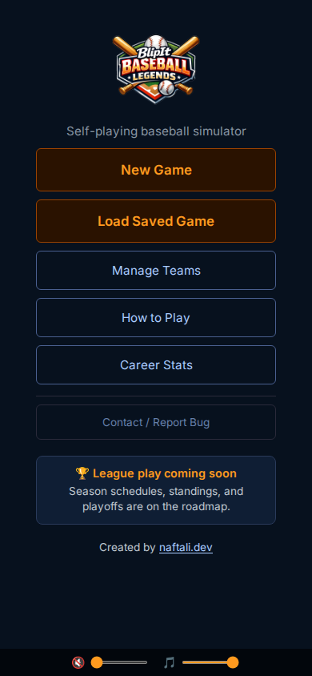 |

### New Game setup

| Desktop | Mobile |
|---|---|
| 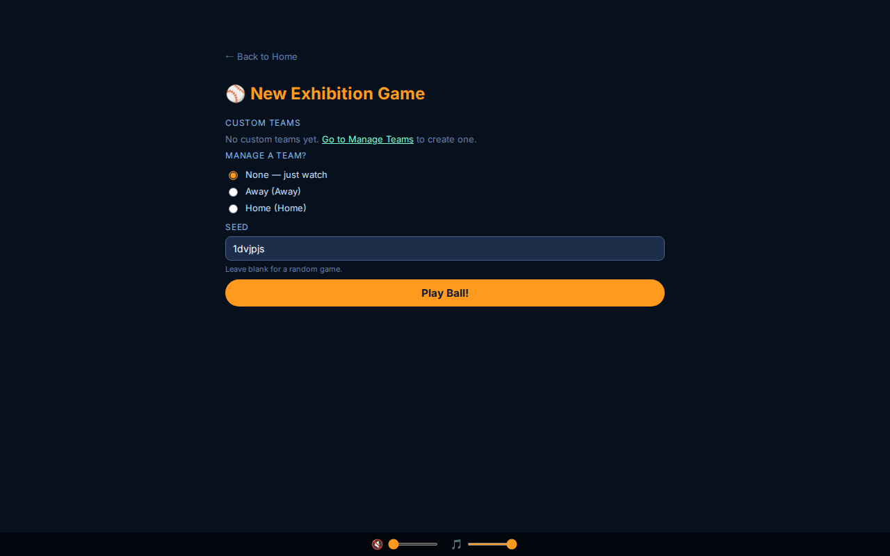 | 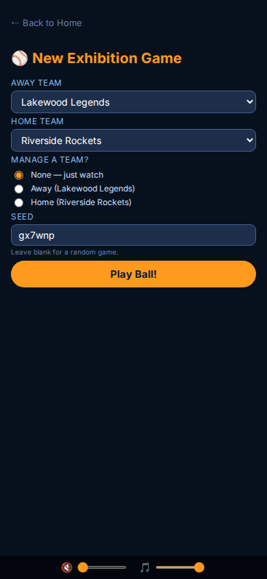 |

### In-game view

| Desktop | Mobile |
|---|---|
| 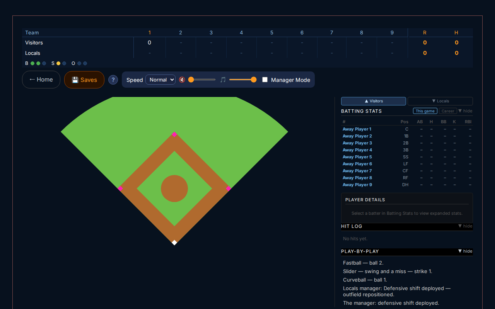 | 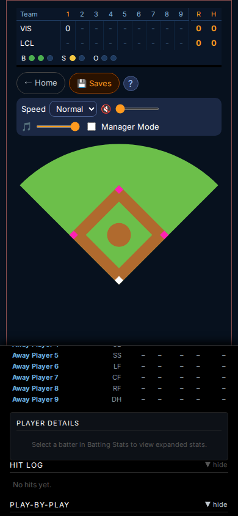 |

### Manager Mode decision panel

| Desktop | Mobile |
|---|---|
|  |  |

### How to play

| Desktop | Mobile |
|---|---|
| 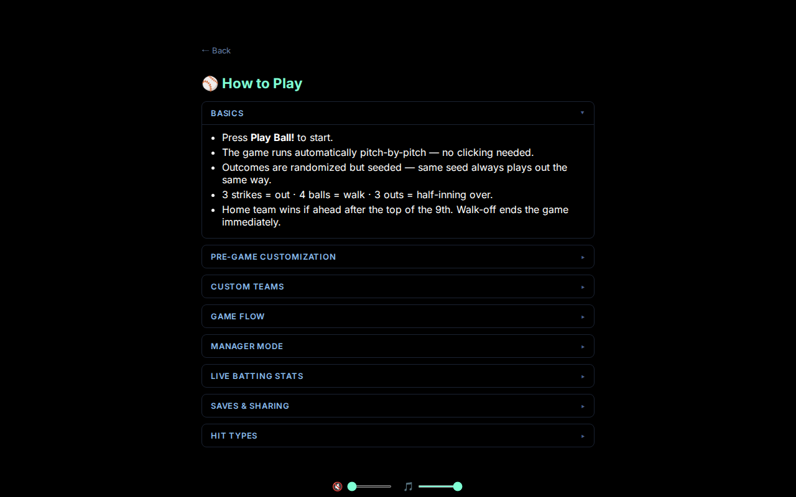 | 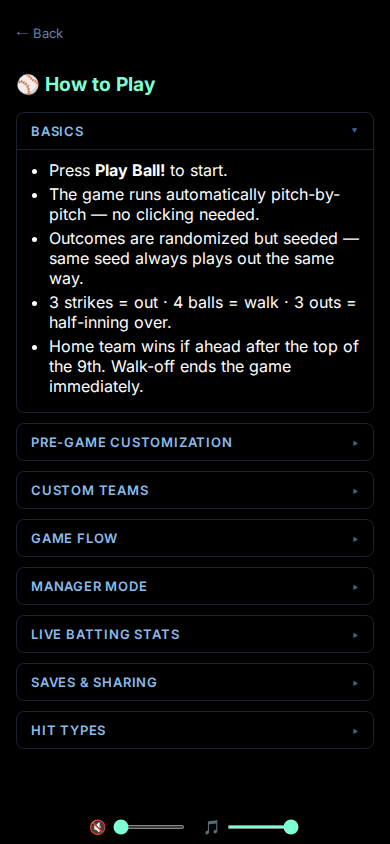 |

### Saves

| Desktop | Mobile |
|---|---|
| 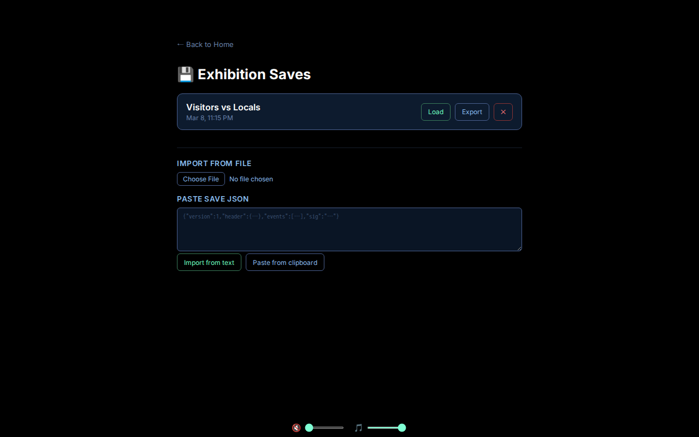 | 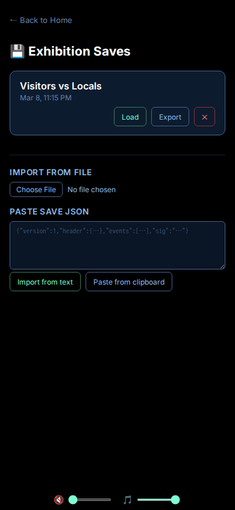 |

### Career Stats

| Desktop | Mobile |
|---|---|
| 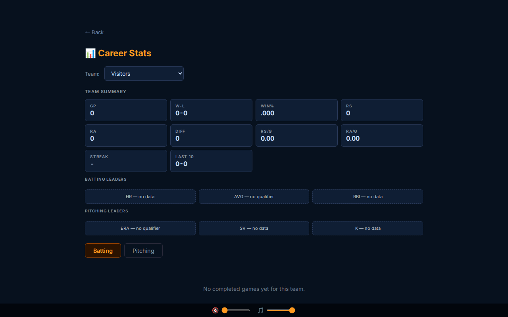 | 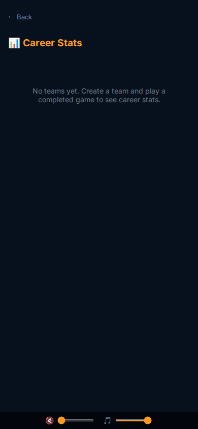 |

### Manage Teams

| Desktop | Mobile |
|---|---|
| 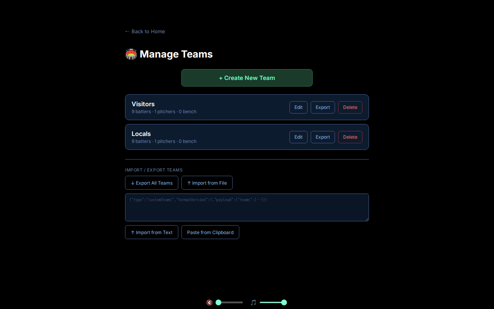 | 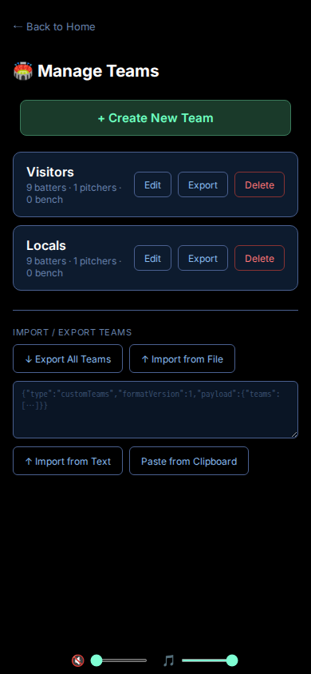 |

### Team Editor

| Desktop | Mobile |
|---|---|
| 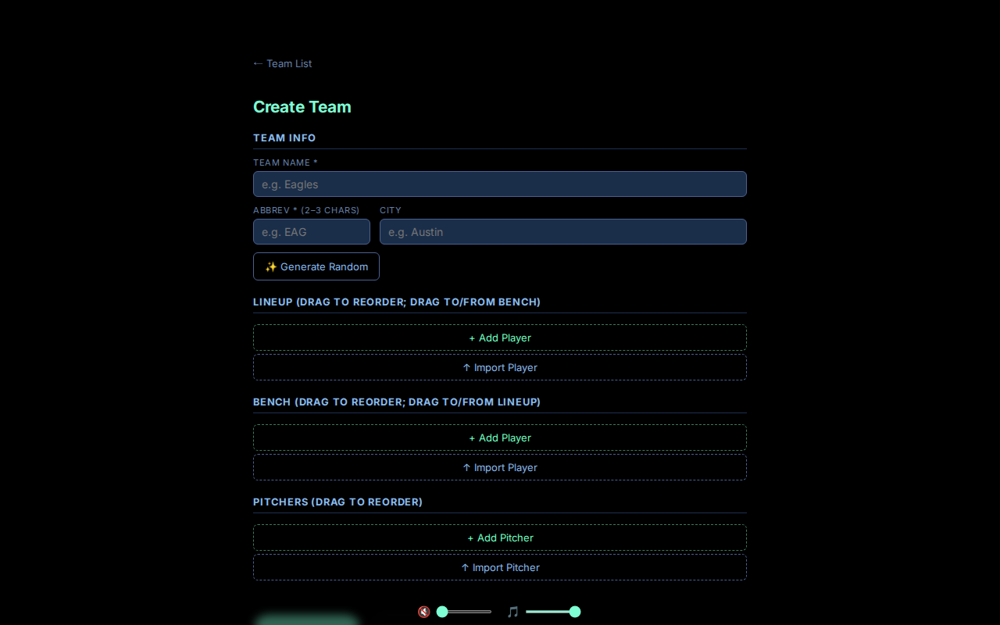 | 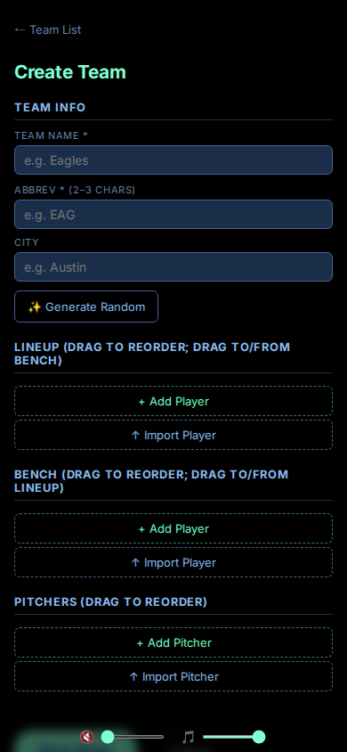 |

---

## Features

- **Installable PWA** — add to your Android or desktop home screen for a native app experience with its own ⚾ icon.
- **Step-by-step or auto-play** — press *Batter Up!* (or Spacebar) for one pitch at a time, or enable Auto-play and choose Slow / Normal / Fast speed.
- **Play-by-play announcements** — the Web Speech API narrates every pitch, hit, and out.
- **Live scoreboard** — line score with per-inning runs, hits, balls/strikes/outs indicator, and an EXTRA INNINGS banner when the game goes deep.
- **Live batting stats panel** — AB, H, HR, RBI, AVG, OBP, and SLG for every batter in both lineups, updated in real time.
- **Realistic game logic** — four pitch types (fastball, curveball, slider, changeup), ground-ball double plays, walk-off wins, extra-inning tiebreak runners, and a home-team "no need to bat" rule.
- **Pre-game player customisation** — before the first pitch:
  - Create custom teams with names, rosters, and per-player stat settings.
  - Drag-and-drop batting order reordering.
  - Per-player stat settings for Contact, Power, Speed, and pitching attributes.
- **Custom team builder** — create, edit, and save your own teams with full roster management:
  - Lineup (9 players), bench (substitutes), and pitchers — all sections support **drag-and-drop reordering**.
  - Drag a lineup player onto the bench (or vice versa) to swap them between sections without copy-paste.
  - Per-player contact/power/speed/velocity/control/movement stats with cap enforcement.
  - Export any team or individual player to a portable signed JSON file; import files back on any device.
  - Duplicate player detection on import — shows a confirmation prompt before overwriting.
  - FNV-1a content fingerprints on every player and team for identity tracking across imports.
- **Seeded randomness** — every autoplay game is fully deterministic from its seed and team/roster configuration. In Manager Mode, manager decisions are also required to reproduce the same outcome exactly.
- **Manager Mode** — pick a team and a strategy (Balanced / Aggressive / Patient / Contact / Power) and make real decisions at key moments:
  - Steal attempt
  - Sacrifice bunt
  - Intentional walk (7th inning+, close game, 2 outs)
  - Pinch-hitter (7th inning+, runner on 2nd or 3rd, &lt; 2 outs)
  - Defensive shift
  - Count-based swing/take choices
- **Browser notifications** — optional notifications alert you when a Manager decision is ready, even when the tab is in the background.
- **10-second auto-skip** — decisions auto-skip with a countdown bar if you don't act in time.
- **Career Stats** — a dedicated stats page tracking every team's win/loss record, run differential, batting leaders (HR, AVG, RBI), and pitching leaders (ERA, SV, K) across all completed games. Drill into any player for a full career batting and pitching breakdown.
- **RxDB persistence** — saves, game events, and custom team data are all stored locally in IndexedDB via [RxDB](https://rxdb.info). No server required. Auto-save resumes your last game on reload.
- **Save management** — a dedicated saves page for naming and managing game slots, loading previous games, exporting saves as JSON for backup/sharing, and importing from a file.
- **Volume controls** — independent sliders and mute buttons for voice announcements and alert chimes.

---

## Getting started

**Requirements:** Node 24.x, Yarn Berry v4.

```bash
# Install dependencies
yarn

# Start the dev server (http://localhost:5173)
yarn dev

# Run unit tests
yarn test

# Run E2E tests (builds app first, then runs Playwright)
yarn test:e2e

# Update visual regression snapshots
yarn test:e2e:update-snapshots

# Production build → dist/
yarn build
```

---

## Testing

### Unit tests (Vitest)

Co-located next to their source files. Run with:

```bash
yarn test               # one-shot
yarn test:coverage      # with coverage report (90 % lines/functions/statements, 80 % branches)
```

### E2E tests (Playwright)

End-to-end tests live in `e2e/` and cover the highest-risk user flows across
**7 browser / device projects**: a dedicated `determinism` project (desktop
Chromium) plus `desktop`, `tablet`, `iphone-15-pro-max`, `iphone-15`,
`pixel-7`, and `pixel-5`.

```bash
yarn test:e2e                       # build + run all E2E tests headlessly
yarn test:e2e:ui                    # open Playwright UI for interactive debugging
yarn test:e2e:update-snapshots      # regenerate visual regression baselines
```

| Spec | What it covers |
|---|---|
| `smoke.spec.ts` | App loads, New Game dialog visible, Play Ball starts autoplay |
| `determinism.spec.ts` | Same seed (via seed input field) → identical play-by-play (uses isolated IndexedDB contexts) |
| `save-load.spec.ts` | Save game, load game, autoplay resumes after load |
| `import.spec.ts` | Import fixture JSON, save appears in list with Load button |
| `responsive-smoke.spec.ts` | Scoreboard + field + log visible & non-zero sized on all viewports |
| `visual/*.visual.spec.ts` | Pixel-diff snapshots: New Game dialog, in-game scoreboard, saves modal, team editor, decision panel |
| `manager-mode.spec.ts` | Manager Mode toggle + strategy selector visible after game starts |
| `custom-team-editor.spec.ts` | Team editor interactions, drag handles present, no up/down buttons |
| `manage-teams-and-custom-game-flow.spec.ts` | Full Create/Edit/Delete team + start custom game |
| `import-export-teams.spec.ts` | Export/import round-trip, legacy file import, tamper detection, dedup skip |
| `substitution.spec.ts` | Pinch hitter substitution flow |

**Key implementation notes:**
- `data-testid` attributes on all critical elements enable stable locators.
- Each play-by-play log entry has a hidden `data-log-index` attribute (`0` = oldest event), used by `captureGameSignature` to build a stable determinism signature that does not shift as autoplay prepends new entries.
- The webServer is `vite preview` (production build), not `yarn dev`, to avoid the RxDB dev-mode plugin hanging in headless Chromium.
- Seeds are set via the seed input field on the New Game form, which calls `reinitSeed(seedStr)` on submit. E2E tests use the seed input field via `configureNewGame(page, { seed: "..." })`.


## UI Style Guide

The visual design of Ballgame follows a strict dark-theme system documented in **[`docs/style-guide.md`](docs/style-guide.md)**.  
Consult it before adding or changing any UI element — it covers:

- **Color palette** — every background, border, text, accent, and status color with hex values
- **Typography** — font families, the full type scale, weights, and letter-spacing rules
- **Breakpoints** — `mobile ≤ 768px`, `tablet 769–1023px`, `desktop ≥ 1024px` via `mq.*` helpers
- **Buttons** — primary (green), secondary (blue outline), game-controls variants, CTA, action, back, and icon buttons
- **Form elements** — text inputs, selects, radios, checkboxes, labels, sliders, and file inputs
- **Modals & dialogs** — chrome, titles, close buttons, backdrops, and mobile full-screen behavior
- **Cards & panels** — save cards, summary stat cells, leader cards, substitution panel, decision panel
- **Tables** — stats tables, line score table, BSO indicator row
- **Status & feedback** — validation errors, empty states, banners, loading states

---

## Tech stack

| Layer | Technology |
|---|---|
| Framework | React 19 (hooks) |
| Language | TypeScript 5 |
| Styling | styled-components v6 + SASS |
| Bundler | Vite v7 |
| Unit testing | Vitest + Testing Library |
| E2E testing | Playwright (7 device projects) |
| Speech | Web Speech API |
| Audio | Web Audio API |
| Randomness | Seeded PRNG (mulberry32) |
| Local DB | RxDB v17 (IndexedDB via Dexie) |
| Drag & Drop | @dnd-kit |
| PWA | Web App Manifest + Service Worker |
| Deployment | Vercel |

---

## License

GPL-3.0 © [Naftali Lubin](https://github.com/maniator)
