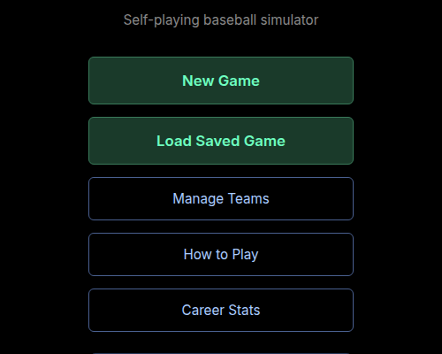
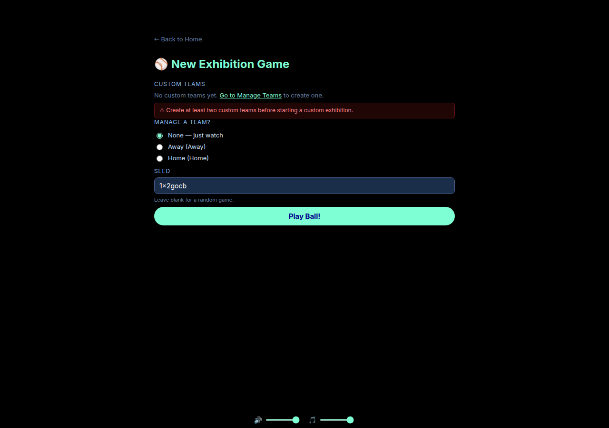
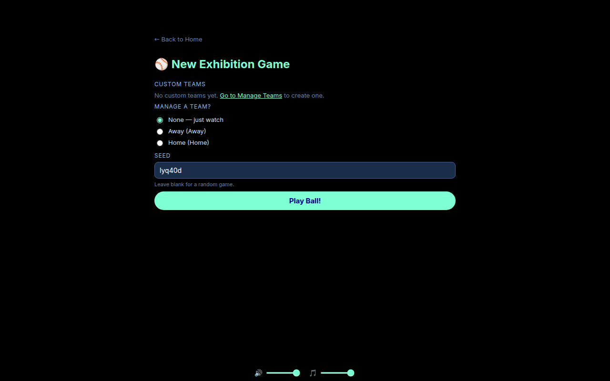
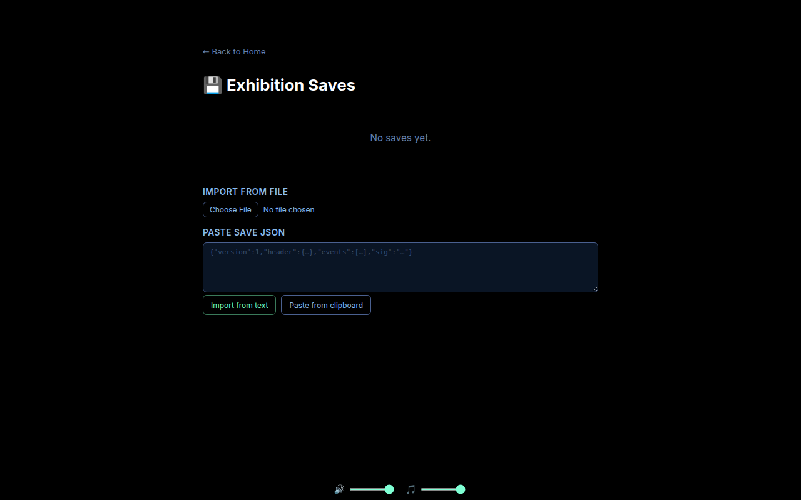
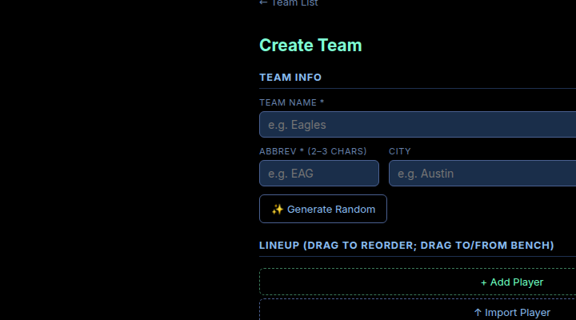
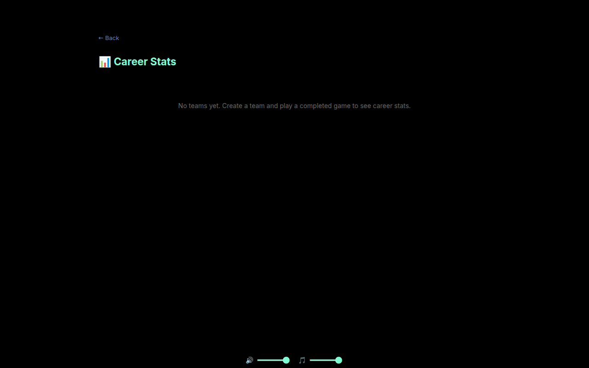
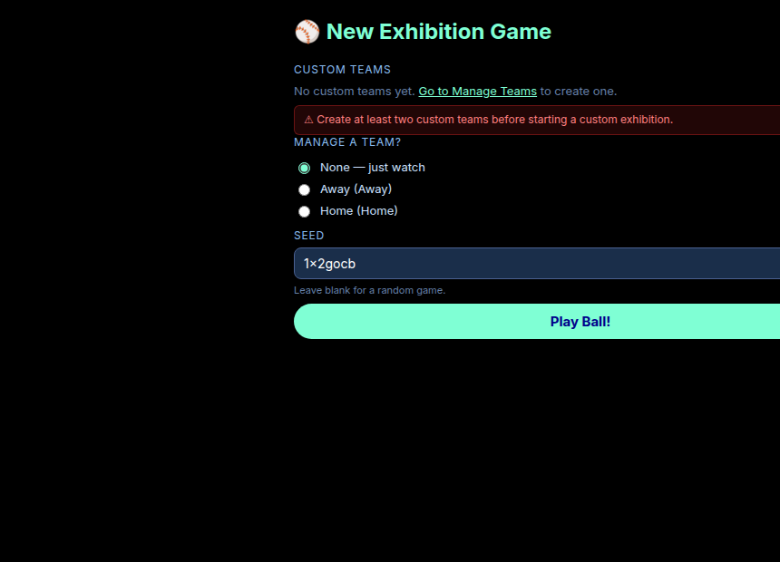
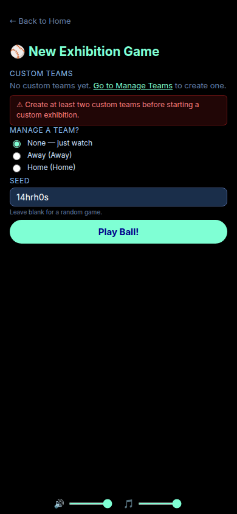
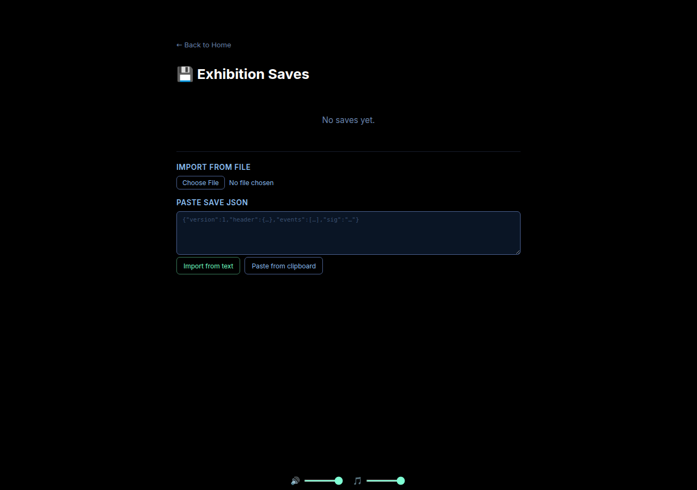
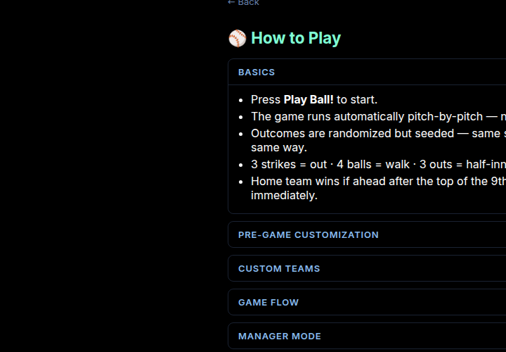

# Ballgame UI Style Guide

> **Purpose** — This document is the single source of truth for every visual decision in the Ballgame UI.  
> Reference it before introducing any new color, font size, button, form element, or interactive component to keep the app consistent.

---

## Contents

1. [Color Palette](#1-color-palette)
2. [Typography](#2-typography)
3. [Breakpoints & Layout](#3-breakpoints--layout)
4. [Buttons](#4-buttons)
5. [Form Elements](#5-form-elements)
6. [Modals & Dialogs](#6-modals--dialogs)
7. [Page Layout](#7-page-layout)
8. [Cards & Panels](#8-cards--panels)
9. [Navigation](#9-navigation)
10. [Tables & Data Display](#10-tables--data-display)
11. [Game UI](#11-game-ui)
12. [Status & Feedback](#12-status--feedback)
13. [Collapsible Sections](#13-collapsible-sections)

---

## 1. Color Palette

The app uses an exclusively dark theme. There is no light mode. Every surface, border, and text color below is the only acceptable value for that role — do not introduce new one-off colors.

### Base (backgrounds)

| Token | Hex | Usage |
|---|---|---|
| `--bg-void` | `#000` / `black` | Page/body background |
| `--bg-surface` | `#0d1b2e` | Panels, cards, dialogs, save-card backgrounds |
| `--bg-input` | `#1a2e4a` | Text inputs, textareas |
| `--bg-input-sm` | `#1a2440` | Small inline selects (game controls) |
| `--bg-game` | `#0a1628` | Line-score table, BSO bar |
| `--bg-game-alt` | `#0a0a1a` / `#0a1520` | Import textareas, deep-nested areas |

### Borders

| Token | Hex | Usage |
|---|---|---|
| `--border-panel` | `#2a3a5a` | Cards, summary cells, leader cards |
| `--border-form` | `#4a6090` | Inputs, selects, dialog chrome, close buttons |
| `--border-subtle` | `#2a2a3a` | Stats tables, inactive tab borders |
| `--border-dark` | `#1e3050` | Section headings, game grid lines |
| `--border-green` | `#3a7a5a` | Primary (green) button borders |
| `--border-danger` | `#883333` | Danger button borders, validation errors |

### Text

| Token | Hex | Usage |
|---|---|---|
| `--text-primary` | `#fff` / `#ffffff` | Primary content, headings, active cell text |
| `--text-body` | `#cce0ff` | Body text in dialogs, list items |
| `--text-muted` | `#888` / `#aaa` | Sub-labels, empty states, inactive tabs |
| `--text-dimmer` | `#666` | Very quiet secondary text |
| `--text-hint` | `#6680aa` | Back buttons, save dates, field labels, placeholder |
| `--text-link` | `#aaccff` | Secondary interactive text, close button text |
| `--text-secondary-link` | `#88bbee` | Section sub-headers, small action buttons |
| `--text-score` | `#e8d5a3` | Line-score table cells (warm off-white) |
| `--text-score-header` | `#8abadf` | Line-score column headers |

### Accent colors

| Token | Hex / Named | Usage |
|---|---|---|
| `--accent-primary` | `aquamarine` (`#7fffd4`) | Primary CTA background (Batter Up!, Play Ball!), focus rings, title highlights, decision panel border |
| `--accent-green` | `#6effc0` | Primary button text, leader card stat values, active tab text |
| `--accent-gold` | `#f0c040` / `#f5c842` | Line-score accent column, teaser box title |
| `--accent-blue-link` | `#aaccff` | Player links, secondary interactive elements |

### Status & semantic

| Token | Hex | Usage |
|---|---|---|
| `--green-bg` | `#1a3a2a` | Primary button background, active tab background |
| `--green-hover` | `#254f38` | Primary button hover |
| `--green-active` | `#0e2418` | Primary button active/press |
| `--red-danger` | `#ff7070` / `#ff8080` | Danger text, validation messages |
| `--red-bg` | `#b30000` | Game-over banner |
| `--red-hover` | `rgba(120, 48, 48, 0.4)` | Danger button hover overlay |
| `--blue-extra` | `#0f4880` | Extra-innings banner |
| `--gold-teaser` | `#7a3200` | Database reset/warning notice |

### Countdown (time-sensitive progress bars)

| Threshold | Color |
|---|---|
| > 50 % | `#44cc88` (green) |
| 25–50 % | `#ffaa33` (orange) |
| < 25 % | `#ff4444` (red) |

### Fatigue indicator text

| Level | Color |
|---|---|
| High | `#ff6b6b` |
| Medium | `#ffd06b` |
| Low | `#a0b4d0` |

### Semi-transparent overlays

| Usage | Value |
|---|---|
| Dialog backdrop (saves) | `rgba(0, 0, 0, 0.65)` |
| Dialog backdrop (instructions / exhibition) | `rgba(0, 0, 0, 0.75)` |
| Auto-play controls group | `rgba(47, 63, 105, 0.5)` |
| Interactive hover on blue surfaces | `rgba(74, 96, 144, 0.15–0.40)` |
| Decision panel background | `rgba(0, 30, 60, 0.92)` |
| Danger hover on buttons | `rgba(120, 48, 48, 0.4)` |

---

## 2. Typography

### Font families

**Source file:** `src/index.scss`

```scss
/* Primary — used everywhere */
$font-sans:
  "Inter Variable",   /* locally bundled via @fontsource-variable/inter */
  system-ui, -apple-system, "Segoe UI", Roboto, "Helvetica Neue",
  Arial, sans-serif,
  "Apple Color Emoji", "Segoe UI Emoji", "Segoe UI Symbol";

/* Monospace — score counts, stat alignment, debug areas */
$font-mono:
  ui-monospace, "Cascadia Code", "Source Code Pro",
  Menlo, Consolas, "DejaVu Sans Mono", monospace;

/* Line score table specifically */
font-family: "Courier New", Courier, monospace;
```

All `<button>`, `<input>`, `<select>`, and `<textarea>` elements inherit `$font-sans` via the global `font: inherit` reset.

### Type scale

| Role | Desktop | Mobile | Weight | Transform |
|---|---|---|---|---|
| Logo (`HomeLogo`) | `3rem` | `2.5rem` | 400 | — |
| Page title H1 (`HomeTitle`) | `2.2rem` | `1.8rem` | 400 | — |
| Page title H1 (standard pages) | `1.5rem` – `1.8rem` | `1.2rem` – `1.3rem` | 400 | — |
| Dialog / modal title | `17px` – `18px` | `16px` | 400 | — |
| Editor section title | `1.3rem` | `1.3rem` | 400 | — |
| Primary button | `1.05rem` | `0.95rem` | 600 | — |
| CTA button (Play Ball!) | `15px` (fullwidth) | — | 700 | — |
| Game controls button | `15px` | `13px` | varies | — |
| Body / dialog text | `14px` | `14px` | 400 | — |
| Table cell | `13px` | `13px` | 400 | — |
| Label / section heading | `12px` | `12px` | 600 | `uppercase` |
| Small label / field label | `11px` | `11px` | 400–600 | `uppercase` |
| Summary cell label / leader stat label | `10px` | `10px` | 600 | `uppercase` |

**Letter spacing** for uppercase labels: `0.5px` – `1px` depending on size.  
**Line height** for prose (help/instructions): `1.6`.

---

## 3. Breakpoints & Layout

**Source file:** `src/shared/utils/mediaQueries.ts` + `src/index.scss`

| Name | Rule | Applies to |
|---|---|---|
| `mq.mobile` | `max-width: 768px` | Phone portrait layouts |
| `mq.tablet` | `769px – 1023px` | Tablet portrait/landscape |
| `mq.desktop` | `min-width: 1024px` | Laptop and wider |
| `mq.notMobile` | `min-width: 769px` | Tablet + desktop shared overrides |

Always use `mq.*` helpers from `@shared/utils/mediaQueries` in styled-components — never write raw `@media` strings.  
Always use `dvh` (dynamic viewport height), never bare `vh`, for height-constrained elements like modals.

**Body padding:**

| Viewport | Body padding |
|---|---|
| Desktop | `40px 0` |
| Tablet | `0` (game fills `100dvh`) |
| Mobile | `0` (game fills `100dvh`, body `overflow: hidden`) |

---

## 4. Buttons

### 4.1 Primary (green) — home menu

**Source file:** `src/features/gameplay/components/HomeScreen/styles.ts` → `PrimaryBtn`

Used for the most important call-to-action on a given screen (e.g. **New Game**, **Load Saved Game**).

| Property | Value |
|---|---|
| Background | `#1a3a2a` |
| Color | `#6effc0` |
| Border | `1px solid #3a7a5a` |
| Border-radius | `6px` |
| Padding | `16px 20px` |
| Font-size | `1.05rem` (desktop) / `0.95rem` (mobile) |
| Font-weight | `600` |
| Min-height | `52px` |
| Hover | `background: #254f38` |
| Active | `background: #0e2418` |
| Focus-visible | `outline: 2px solid aquamarine; outline-offset: 2px` |


*Home screen: primary (green) and secondary (blue-outline) buttons side by side*

```tsx
// ✅ Correct usage
<PrimaryBtn onClick={handleNewGame}>New Game</PrimaryBtn>
```

---

### 4.2 Secondary (blue outline) — home menu

**Source file:** `src/features/gameplay/components/HomeScreen/styles.ts` → `SecondaryBtn`

Used for supporting actions on the home screen (e.g. **Manage Teams**, **How to Play**, **Career Stats**).

| Property | Value |
|---|---|
| Background | `transparent` |
| Color | `#aaccff` |
| Border | `1px solid #4a6090` |
| Border-radius | `6px` |
| Padding | `14px 20px` |
| Font-size | `0.95rem` |
| Min-height | `48px` |
| Hover | `background: #0d1b2e; border-color: #88bbee; color: #cce0ff` |
| Active | `background: #071020` |
| Focus-visible | `outline: 2px solid aquamarine; outline-offset: 2px` |

---

### 4.3 Game controls buttons

**Source file:** `src/features/gameplay/components/GameControls/styles.ts` → `Button`

Rounded pill buttons used inside the in-game controls bar. Choose a `$variant` based on the action weight.

| Variant | Background | Color | Border | When to use |
|---|---|---|---|---|
| `default` | `aquamarine` | `darkblue` | none | Primary pitch action (Batter Up!) |
| `new` | `#22c55e` | `#fff` | none | Start a new game from in-game |
| `saves` | `#1a3a2a` | `#6effc0` | `1px solid #3a7a5a` | Load/save actions |
| `home` | `transparent` | `#aaa` | `1px solid #444` | Return to home |

Common properties for all game-controls variants:

| Property | Value |
|---|---|
| Border-radius | `30px` (full-pill) |
| Padding | `12px 18px` (desktop) / `8px 12px` (mobile) |
| Font-size | `15px` (desktop) / `14px` (base) / `13px` (mobile) |

The **Batter Up!** button (`BatterUpButton`) extends `Button` with `font-size: 18px` / `20px` (desktop) and `padding: 16px 28px` / `18px 32px`.


*Full in-game desktop view showing the controls bar, score panel, field, and play log*

```tsx
// ✅ Correct usage
<Button $variant="default" onClick={handlePitch}>⚾ Batter Up!</Button>
<Button $variant="new" onClick={handleNewGame}>New Game</Button>
<Button $variant="saves" onClick={handleSave}>💾 Save</Button>
<Button $variant="home" onClick={handleHome}>← Home</Button>
```

---

### 4.4 CTA / Play Ball button

**Source file:** `src/features/exhibition/pages/ExhibitionSetupPage/` + `src/features/exhibition/components/NewGameDialog/`

Full-width `aquamarine` button for the primary form submission action.

| Property | Value |
|---|---|
| Background | `aquamarine` |
| Color | `darkblue` |
| Border | none |
| Border-radius | `30px` |
| Padding | `16px` (desktop) |
| Font-weight | `700` |
| Font-size | `15px` |
| Width | `100%` |


*New Exhibition Game page: labels, radio buttons, text input, and the full-width aquamarine CTA*

---

### 4.5 Action buttons (save cards / substitution panel)

**Source file:** `src/features/saves/components/SaveSlotList/styles.ts` → `ActionBtn`

Small bordered buttons for inline actions on cards and panels. Use the `$variant` prop.

| Variant | Color | Border | Hover background |
|---|---|---|---|
| `primary` | `#6effc0` | `#3a7a5a` | `#1a3a2a` |
| `secondary` (default) | `#88bbee` | `#4a6090` | `#0d1b2e` |
| `danger` | `#ff7777` | `#883333` | `#2a0000` |

Common properties:

| Property | Value |
|---|---|
| Background | `transparent` |
| Border-radius | `6px` |
| Padding | `6px 12px` |
| Font-size | `12px` |
| Min-height | `32px` |
| Focus-visible | `outline: 2px solid aquamarine; outline-offset: 2px` |


*Saves page: each save card has Load (primary), Export (secondary), and Delete (danger) action buttons*

```tsx
// ✅ Correct usage
<ActionBtn $variant="primary" onClick={load}>Load</ActionBtn>
<ActionBtn $variant="secondary" onClick={exportSave}>Export</ActionBtn>
<ActionBtn $variant="danger" onClick={deleteSave}>Delete</ActionBtn>
```

---

### 4.6 Help / circular icon button

**Source file:** `src/features/gameplay/components/GameControls/styles.ts` → `HelpButton`

Small circular button for contextual help triggers.

| Property | Value |
|---|---|
| Background | `rgba(47, 63, 105, 0.7)` |
| Color | `#aaccff` |
| Border | `1px solid #4a6090` |
| Border-radius | `50%` |
| Size | `25 × 25px` |
| Font-size | `15px` |
| Hover | `background: rgba(74, 96, 144, 0.9); color: #fff` |

---

### 4.7 Back button

**Source file:** `src/shared/components/PageLayout/styles.ts` → `BackBtn`

Minimal text-only navigation button. Used at the top-left of every route-level page.

| Property | Value |
|---|---|
| Background | `transparent` |
| Color | `#6680aa` |
| Border | none |
| Font-size | `13px` |
| Padding | `4px 0` |
| Min-height | `36px` |
| Hover | `color: #aaccff` |
| Focus-visible | `outline: 2px solid aquamarine; outline-offset: 2px; border-radius: 3px` |

```tsx
// ✅ Correct usage
import { BackBtn } from "@shared/components/PageLayout/styles";
<BackBtn onClick={() => navigate(-1)}>← Back to Home</BackBtn>
```

---

## 5. Form Elements

### 5.1 Text input

**Source file:** `src/features/customTeams/components/CustomTeamEditor/styles.ts` → `TextInput`  
Also used in exhibition setup and dialog forms.

| Property | Value |
|---|---|
| Background | `#1a2e4a` |
| Border | `1px solid #4a6090` |
| Color | `#fff` |
| Border-radius | `6px` – `8px` |
| Padding | `7px 10px` (editor) / `8px 10px` (dialog) |
| Font-family | inherit |
| Font-size | `14px` |
| Width | `100%` |
| Focus | `outline: 2px solid aquamarine; outline-offset: 1px` |
| Validation error | `border-color: #ff7777` (set via `aria-invalid="true"`) |
| Placeholder | `color: #3a5070` |


*Team editor: text inputs, field labels, and stat sliders all in context*

---

### 5.2 Select / dropdown

**Source file:** `src/features/gameplay/components/GameControls/styles.ts` → `Select`  
Also `CareerStatsPage/styles.ts` → `TeamSelect`

| Property | Value |
|---|---|
| Background | `#1a2440` (compact) / `#0d1b2e` (page-level) |
| Border | `1px solid #4a6090` |
| Color | `#fff` / `#cce0ff` |
| Border-radius | `6px` – `8px` |
| Padding | `3px 6px` (compact) / `8px 12px` (page) |
| Font-family | inherit |
| Font-size | `12px` – `14px` |
| Option background | `#0a0a1a` |
| Focus | `outline: 2px solid aquamarine; outline-offset: 1px` |

---

### 5.3 Radio buttons

**Source file:** `src/features/exhibition/pages/ExhibitionSetupPage/` (inline `<label>` + `<input type="radio">`)

| Property | Value |
|---|---|
| `accent-color` | `aquamarine` |
| Label font-size | `13px` (mobile) / `14px` (desktop) |
| Label color | `#cce0ff` |
| Label gap | `8px` |
| Label padding | `4px 0` (desktop) / `2px 0` (mobile) |
| Cursor | `pointer` |

---

### 5.4 Checkboxes

**Source file:** `src/features/gameplay/components/GameControls/styles.ts` → `ToggleLabel`

| Property | Value |
|---|---|
| `accent-color` | `aquamarine` |
| Size | `14 × 14px` |
| Label font-size | `13px` (mobile) / `14px` (desktop) |
| Label gap | `6px` |

---

### 5.5 Form labels

**Source file:** `src/features/customTeams/components/CustomTeamEditor/styles.ts` → `FieldLabel`

Used above every input, select, or group of controls.

| Property | Value |
|---|---|
| Font-size | `11px` |
| Text-transform | `uppercase` |
| Letter-spacing | `0.6px` |
| Color | `#6680aa` |

Section-level labels (above larger groups) use:

| Property | Value |
|---|---|
| Font-size | `12px` |
| Text-transform | `uppercase` |
| Letter-spacing | `0.8px` |
| Color | `#88bbee` |

---

### 5.6 Stat range sliders

**Source file:** `src/features/customTeams/components/CustomTeamEditor/styles.ts` → `StatInput`

| Property | Value |
|---|---|
| `accent-color` | `aquamarine` |
| Cursor | `pointer` |
| Stat label color | `#6680aa`, `11px` |
| Stat value color | `#aaccff`, `12px` |

---

### 5.7 File input

| Property | Value |
|---|---|
| `::file-selector-button` background | `transparent` |
| `::file-selector-button` color | `#88bbee` |
| `::file-selector-button` border | `1px solid #4a6090` |
| `::file-selector-button` border-radius | `6px` |
| `::file-selector-button` padding | `4px 10px` |
| `::file-selector-button` hover | `background: #0d1b2e` |

---

## 6. Modals & Dialogs

All modals use the native `<dialog>` element with `::backdrop`.

### 6.1 Common dialog chrome

| Property | Value |
|---|---|
| Background | `#0d1b2e` |
| Color | `#e0f0ff` |
| Border | `2px solid #4a6090` |
| Border-radius | `14px` (desktop) / `10px` (mobile, exhibition) |
| Font-size | `14px` |
| Line-height | `1.6` (instructions) |

**Backdrop:** `rgba(0, 0, 0, 0.65)` (saves) or `rgba(0, 0, 0, 0.75)` (instructions, exhibition setup).

### 6.2 Dialog title

| Property | Value |
|---|---|
| Color | `aquamarine` |
| Font-size | `17px` – `18px` |
| Margin | `0` |

### 6.3 Close button (×)

| Property | Value |
|---|---|
| Background | `transparent` |
| Color | `#aaccff` |
| Border | `1px solid #4a6090` |
| Border-radius | `6px` |
| Size | `28 × 28px` |
| Font-size | `16px` |
| Hover | `background: rgba(74, 96, 144, 0.6); color: #fff` |

### 6.4 Dialog footer close button

| Property | Value |
|---|---|
| Background | `aquamarine` |
| Color | `darkblue` |
| Border | none |
| Border-radius | `20px` |
| Padding | `7px 22px` – `8px 24px` |
| Font-weight | `600` |

### 6.5 Mobile dialog full-screen

On mobile (`max-width: 768px`) the instructions modal becomes full-screen:

```css
position: fixed;
inset: 0;
width: 100vw; max-width: 100vw;
height: 100dvh;
border-radius: 0;
border: none;
```

---

## 7. Page Layout

**Source file:** `src/shared/components/PageLayout/styles.ts`

All route-level pages use `PageContainer` + `PageHeader` + `BackBtn`. Never redefine these per page — import from `@shared/components/PageLayout/styles`.

### 7.1 PageContainer

```css
display: flex; flex-direction: column;
min-height: 100dvh;
padding: 24px;
padding-bottom: calc(24px + 80px);  /* clear fixed game controls bar */
max-width: 680px;
margin: 0 auto;
width: 100%;

/* Mobile */
padding: 16px;
padding-bottom: calc(16px + 80px);
height: 100dvh;
overflow-y: auto;
-webkit-overflow-scrolling: touch;
```

`CareerContainer` (career stats) overrides `max-width` to `900px` to accommodate wide tables.

### 7.2 PageHeader

```css
display: flex; align-items: center;
gap: 12px;
margin-bottom: 20px;
```

### 7.3 Page titles (H1)

Standard: `color: aquamarine; font-size: 1.5rem; margin: 0 0 20px`  
Career stats: `font-size: 1.4rem`  
Team editor section title: `color: aquamarine; font-size: 1.3rem`


*New Exhibition Game page: PageContainer, PageHeader with BackBtn, aquamarine H1, section labels, and form elements*

---

## 8. Cards & Panels

### 8.1 Save cards

**Source file:** `src/features/saves/components/SaveSlotList/styles.ts` → `SaveCard`

| Property | Value |
|---|---|
| Background | `#0d1b2e` |
| Border | `1px solid #4a6090` |
| Border-radius | `10px` |
| Padding | `14px 16px` |
| Save name | `color: white; font-size: 1rem; font-weight: 600` |
| Save date | `color: #6680aa; font-size: 12px` |

On mobile the action buttons drop to a second row (`flex-wrap: wrap`).

---

### 8.2 Summary stat cells (career stats)

**Source file:** `src/features/careerStats/pages/CareerStatsPage/teamSummaryStyles.ts` → `SummaryCell`

| Property | Value |
|---|---|
| Background | `#0d1b2e` |
| Border | `1px solid #2a3a5a` |
| Border-radius | `6px` |
| Padding | `10px 12px` |
| Label | `color: #888; font-size: 10px; uppercase; letter-spacing: 0.8px; weight 600` |
| Value | `color: #cce0ff; font-size: 16px; weight 700; font-variant-numeric: tabular-nums` |

Desktop layout: `grid-template-columns: repeat(4, 1fr)`.  
Mobile layout: `repeat(2, 1fr)`.

---

### 8.3 Leader cards (career stats)

**Source file:** `src/features/careerStats/pages/CareerStatsPage/teamSummaryStyles.ts` → `LeaderCard`

Interactive card that navigates to a player career page.

| Property | Value |
|---|---|
| Background | `#0d1b2e` |
| Border | `1px solid #2a3a5a` |
| Border-radius | `6px` |
| Padding | `10px 12px` |
| Hover | `border-color: #4a6090` |
| Focus-visible | `outline: 2px solid aquamarine; outline-offset: 2px` |
| Stat label | `color: #888; 10px; uppercase` |
| Player name | `color: #aaccff; 13px; weight 600; ellipsis` |
| Stat value | `color: #6effc0; 18px; weight 700; tabular-nums` |

Placeholder card uses `border: 1px dashed #2a3a5a`.

Desktop layout: `grid-template-columns: repeat(3, 1fr)`.  
Mobile: `repeat(1, 1fr)`.


*Career stats page: summary stat grid (top) and leader card rows below, plus tab bar and sortable table*

---

### 8.4 Substitution panel

**Source file:** `src/features/gameplay/components/SubstitutionPanel/styles.ts`

| Property | Value |
|---|---|
| Background | `#0d1b2e` |
| Border | `1px solid #2a3f60` |
| Border-radius | `8px` |
| Padding | `12px 14px` |
| Title color | `aquamarine` |
| Title font-size | `0.85rem; weight 600` |
| Section title | `color: #88bbee; 0.7rem; uppercase; letter-spacing 0.6px; border-bottom 1px solid #1e3050` |

---

### 8.5 Decision panel

**Source file:** `src/features/gameplay/components/DecisionPanel/styles.ts`

Manager Mode prompt overlay that appears above game controls.

| Property | Value |
|---|---|
| Background | `rgba(0, 30, 60, 0.92)` |
| Border | `2px solid aquamarine` |
| Border-radius | `12px` |
| Padding | `14px 18px 10px` |
| Prompt text | `color: #e0f8f0; weight 600` |
| Odds text | `color: #aaffcc; font-size: 13px` |

---

### 8.6 League teaser box (home screen)

**Source file:** `src/features/gameplay/components/HomeScreen/styles.ts` → `LeagueTeaserBox`

Non-interactive informational card.

| Property | Value |
|---|---|
| Background | `#0d1b2e` |
| Border | `1px solid #2a3a5a` |
| Border-radius | `8px` |
| Title | `color: #f0c040; 0.88rem; weight 600` |
| Subtitle | `color: #aaa; 0.78rem; line-height 1.4` |

---

## 9. Navigation

### 9.1 Tab bar (career stats)

**Source file:** `src/features/careerStats/styles.ts` → `TabBar` / `TabBtn`

| State | Background | Color | Border | Weight |
|---|---|---|---|---|
| Active | `#1a3a2a` | `#6effc0` | `1px solid #3a7a5a` | `600` |
| Inactive | `transparent` | `#888` | `1px solid #2a2a3a` | `400` |

Common properties: `border-radius: 6px; padding: 8px 20px; font-size: 0.9rem; min-height: 36px`.

Hover (inactive): `background: #0d1b2e; color: #aaccff; border-color: #4a6090`.

```tsx
// ✅ Correct usage
<TabBtn $active={tab === "batting"} onClick={() => setTab("batting")}>Batting</TabBtn>
```

---

### 9.2 Player links (tables)

**Source file:** `src/features/careerStats/styles.ts` → `PlayerLink`

```css
background: transparent; border: none;
color: #aaccff; font-size: 13px;
cursor: pointer; text-align: left;

:hover { color: #cce0ff; text-decoration: underline; }
:focus-visible { outline: 2px solid aquamarine; border-radius: 2px; }
```

---

## 10. Tables & Data Display

### 10.1 Stats table

**Source file:** `src/features/careerStats/styles.ts`

| Element | Styles |
|---|---|
| Table | `width: 100%; border-collapse: collapse; min-width: 600px` |
| `Th` | `text-align: left; padding: 8px; border-bottom: 1px solid #2a2a3a; font-size: 12px; color: #888; weight 600; white-space: nowrap` |
| `Td` | `padding: 8px; border-bottom: 1px solid #1a1a2a; font-size: 13px; color: #ccc; white-space: nowrap` |
| Totals row | `background: #0d1b2e; td { color: #aaccff; weight 600; border-bottom: 2px solid #2a3a5a }` |
| Wrapper | `overflow-x: auto` — always wrap tables in a scrollable container |

Sortable headers add `cursor: pointer; user-select: none` and lighten on hover.

---

### 10.2 Line score table

**Source file:** `src/features/gameplay/components/LineScore/styles.ts`

| Element | Styles |
|---|---|
| Table | `font-family: "Courier New", Courier, monospace; background: #0a1628; color: #e8d5a3; border-collapse: collapse` |
| `Th` | `color: #8abadf (normal) / #f5c842 (accent); border-bottom: 1px solid #1e3a5f; font-weight: normal; font-size: 11–13px; letter-spacing: 0.5px` |
| `Td` | `text-align: center; color: white (active) / #f5c842 (accent) / #3d5a7a (dim) / #e8d5a3 (normal); border-right: 1px solid #0f2540` |

Team name column: left-aligned, `max-width: 90px` (mobile) / `140px` (desktop), `text-overflow: ellipsis`. On mobile shows the 3-letter abbreviation; on desktop shows the full name.

---

### 10.3 BSO indicator row

**Source file:** `src/features/gameplay/components/LineScore/styles.ts` → `BsoRow`

```css
display: flex; align-items: center; gap: 14px;
padding: 6px 8px 4px;
background: #0a1628;
font-family: "Courier New", Courier, monospace;
font-size: 11–12px; color: #8abadf; letter-spacing: 0.5px;
```

**Dot** (`Dot`): `width: 10px; height: 10px; border-radius: 50%`. Active dot fills with the contextual color; inactive fills `#1e3a5f`.

| Indicator | Active color |
|---|---|
| Balls | `#44cc88` (green) |
| Strikes | `#f5c842` (gold) |
| Outs | `#ff7070` (red) |

**Extra-innings banner:** `background: #0f4880; color: #fff; font-weight: bold; font-size: 11px; letter-spacing: 1px`.  
**Game-over banner:** `background: #b30000; color: #fff; font-size: 12px; letter-spacing: 1px`.


*In-game: line score table, BSO dots, base diamond, and batting stats panel*

---

## 11. Game UI

### 11.1 Game container

**Source file:** `src/features/gameplay/components/Game/styles.ts`

- Border: `1px solid #884e4e` (subtle warm border framing the game area)  
- Desktop body: `display: grid; grid-template-columns: 2.2fr 1fr; gap: 20px`  
- Tablet/Mobile: `flex column; height: 100dvh; overflow: hidden`

### 11.2 Play-by-play log panel

- Desktop: right column of the game grid, `border-left: 1px solid #2a2a2a`  
- Mobile: fixed panel at bottom `33vh` of screen, `border-top: 1px solid #333`, `background: #000`, `box-shadow: 0 -6px 12px rgba(0,0,0,0.9)`

### 11.3 Countdown progress bar

**Source file:** `src/features/gameplay/components/DecisionPanel/styles.ts`

```css
CountdownTrack: height: 4px; background: #1a2e1a; border-radius: 2px; overflow: hidden;
CountdownFill: transition: width 0.95s linear, background 0.5s ease;
  /* >50% → #44cc88 (green) | 25–50% → #ffaa33 (orange) | <25% → #ff4444 (red) */
```


*Mobile game view: compact line score, BSO row, diamond field, and bottom log panel*

---

## 12. Status & Feedback

### 12.1 Validation error (form)

| Property | Value |
|---|---|
| Border | `border-color: #ff7777` on input via `aria-invalid="true"` |
| Error message background | `rgba(80, 0, 0, 0.3)` |
| Error message border | `rgba(220, 40, 40, 0.4)` |
| Error text color | `#ff8888` |

Always set `aria-invalid="true"` on the input element — do not use a separate CSS class.

---

### 12.2 Empty state

**Source file:** `src/features/careerStats/styles.ts` → `EmptyState`

```css
text-align: center; padding: 40px;
color: #666; font-size: 14px;
```


*Saves page empty state and page layout*

---

### 12.3 Update banner

**Source file:** `src/shared/components/UpdateBanner/`

Fixed top/bottom amber banner announcing a service worker update. Uses warm amber colors consistent with the `--gold-teaser` family. Does not follow the `#0d1b2e` panel style.

---

### 12.4 Database reset notice

```css
position: fixed; top: 0; left: 0; right: 0; z-index: 9999;
background: #7a3200; color: #fff;
padding: 10px 16px; font-size: 0.9rem;
```

---

### 12.5 Loading state

```css
color: #aaa; text-align: center; margin: 48px auto;
font-family: monospace;
```

---

## 13. Collapsible Sections

**Source file:** `src/features/help/components/HelpContent/styles.ts`

Used by the How to Play / Help page accordion.

| Element | Styles |
|---|---|
| `<details>` wrapper | `border: 1px solid rgba(74,96,144,0.35); border-radius: 8px; margin-bottom: 10px; overflow: hidden` |
| `<summary>` | `color: #88bbee; font-size: 13px; weight 600; uppercase; letter-spacing 0.8px` |
| `<summary>::after` | `content: "▸"; color: #4a6090` — rotates 90° when open |
| Summary hover | `background: rgba(74,96,144,0.15)` |
| Open border | `details[open] > summary { border-bottom: 1px solid rgba(74,96,144,0.35) }` |
| Body | `padding: 10px 14px 12px` |
| List items | `color: #cce0ff; padding-left: 18px; margin-bottom: 4px` |


*Help/How to Play page: collapsible accordion sections in both closed and open states*

```tsx
// ✅ Correct usage
<SectionDetails>
  <SectionSummary>Pitching</SectionSummary>
  <SectionBody>
    <List>
      <Li>Strikeouts remove the batter.</Li>
    </List>
  </SectionBody>
</SectionDetails>
```

---

## Quick Reference

### Focus ring (universal)

All interactive elements must have:

```css
&:focus-visible {
  outline: 2px solid aquamarine;
  outline-offset: 2px;
}
```

Never remove `focus-visible` styles. Some elements (e.g. `BackBtn`) also add `border-radius: 3px` to the outline.

### Disabled state

```css
opacity: 0.4;
cursor: not-allowed;
```

### `Add …` dashed buttons (team editor)

```css
background: transparent;
color: #6effc0;
border: 1px dashed #3a7a5a;
border-radius: 6px;
width: 100%;
padding: 8px 16px;

:hover { background: #0d1b2e; border-color: #6effc0; }
```

### Section dividers / headings in editors

```css
color: #88bbee;
font-size: 0.7–0.8rem;
text-transform: uppercase;
letter-spacing: 0.6–0.8px;
border-bottom: 1px solid #1e3050;
padding-bottom: 4–6px;
margin-bottom: 6–10px;
```

---

## Source file index

| What you're styling | Source file |
|---|---|
| Global fonts, body, breakpoint SCSS variables | `src/index.scss` |
| Breakpoint helpers (`mq.*`) | `src/shared/utils/mediaQueries.ts` |
| Page layout shell (PageContainer, PageHeader, BackBtn) | `src/shared/components/PageLayout/styles.ts` |
| Home screen buttons & teaser box | `src/features/gameplay/components/HomeScreen/styles.ts` |
| In-game controls (Button variants, AutoPlayGroup) | `src/features/gameplay/components/GameControls/styles.ts` |
| Decision panel & countdown bar | `src/features/gameplay/components/DecisionPanel/styles.ts` |
| Line score & BSO row | `src/features/gameplay/components/LineScore/styles.ts` |
| Substitution panel | `src/features/gameplay/components/SubstitutionPanel/styles.ts` |
| Career stats tables, tabs, summary cells | `src/features/careerStats/styles.ts` + `teamSummaryStyles.ts` |
| Save slot cards & action buttons | `src/features/saves/components/SaveSlotList/styles.ts` |
| Saves modal | `src/features/saves/components/SavesModal/styles.ts` |
| Instructions modal | `src/features/help/components/InstructionsModal/styles.ts` |
| Help accordion | `src/features/help/components/HelpContent/styles.ts` |
| Custom team editor form | `src/features/customTeams/components/CustomTeamEditor/styles.ts` |
| Exhibition setup page | `src/features/exhibition/pages/ExhibitionSetupPage/styles.ts` |
